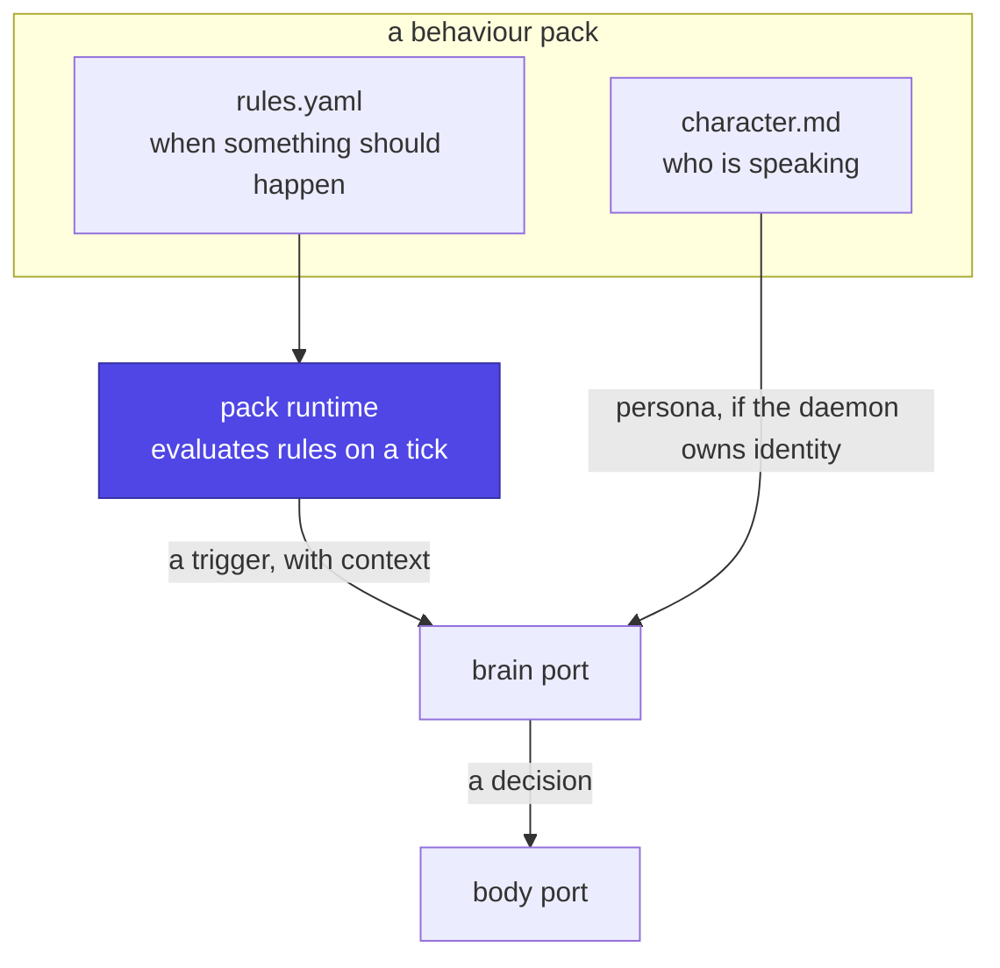

# Behaviour packs

Everything that makes a body *act on its own* is optional, installable, and
lives outside the core. A bare install is a body you can talk to and drive.
A pack is what makes it initiate.

This is where anything resembling a personality, a mood or a virtual pet
belongs — **including a Tamagotchi**, which is a pack rather than the
product.

## Why packs, and not features

The core has one job: connect a brain to a body. The moment it also decides
*when to speak unprompted*, or *what the thing wants*, it stops being a
connector and becomes an opinion — and opinions cannot be swapped.

Two people want incompatible things from the same hardware:

| Someone building | Wants |
|---|---|
| A desk assistant | Silence unless addressed; a calendar reminder is the only interruption |
| A companion | To be greeted when they sit down, and noticed when they leave |
| A virtual pet | Something that asks for attention every two hours and sulks if ignored |

None of those is more correct. All three are the same body, the same brain
and the same contract, differing only in an installed pack.

## What a pack is

Two halves, deliberately separated, because they fail differently:



**`rules.yaml` decides *when*.** Deterministic, inspectable, testable, and
free — no tokens, no network. A schedule and a set of thresholds.

**`character.md` decides *who*.** Prose, handed to the brain as persona —
but only when the daemon owns identity. When the brain is a harness with its
own `soul.md`, the harness owns the voice and the pack contributes only
facts ([identity](identity.md)).

Keeping these apart matters: *"ask for food every two hours"* must be a
timer, not a model's unreliable sense of elapsed time. A language model is a
poor clock, and a pack that relies on one behaves differently on every run.

## The pack runtime

Rules evaluate against state derived as **a pure function of elapsed time
and the event log**:

```text
state(t) = fold(rules, events[t0..t], checkpoint(t0))
```

Nothing else feeds in. Three consequences, and the third is why this
machinery survived the pet being cut:

- A **missed tick changes nothing**. Decay and counters are computed from
  Δt, so a cron firing every 60 s is a scheduling convenience rather than a
  unit of time.
- A **replay from any checkpoint reproduces the present**, so late events
  fold in at their true timestamps.
- A **host that suspends stays correct**. Close a laptop at 18:00, open it at
  09:14, and the runtime folds fifteen hours in one step
  ([deployment](deployment.md)). A tick-counting design would have missed 900
  ticks or died.

## A pack, concretely

```yaml
# packs/tamagotchi/rules.yaml
name: tamagotchi
description: A creature with needs. It will ask for things.

state:
  hunger:  { min: 0, max: 100, start: 20, per_hour: +4 }
  energy:  { min: 0, max: 100, start: 90, per_hour: -3, asleep: +12 }

schedule:
  sleeps: "23:00-07:00"

triggers:
  - when: hunger > 70
    every: 2h                  # rate limit, not a poll
    trigger: needs_food
  - when: idle_for > 4h
    trigger: neglected
  - at: "21:00"
    trigger: journal

actions:
  needs_food:
    say: true                  # ask the brain for a line, in character
    body: [blink]              # and use whatever the body advertises
```

`packs/assistant/` would ship a `rules.yaml` with almost nothing in it, and
that is a complete, valid pack.

**`body: [blink]` is a request, not a requirement.** If the connected body
advertises `blink`, it blinks. If it is a terminal, it does not, and nothing
errors — the pack asks for verbs by name and the
[body contract](body-contract.md) decides what exists.

## Rules that keep packs safe to install

1. **A pack may not act directly on a body.** It emits a trigger; the brain
   decides; the body executes. A pack that could drive servos would be a
   second, untested control path.
2. **A pack may not exceed the interruption budget.** Proactive messages are
   capped centrally, and `quiet` windows are honoured by the core, not by
   each pack's good manners.
3. **A pack cannot invent capabilities.** It names verbs; missing ones are
   silently skipped.
4. **A pack is data, not code**, until there is a strong reason otherwise.
   YAML plus prose is inspectable, diffable and shareable; an installable
   script is a supply-chain problem in a project whose whole point is that
   strangers hand each other bodies and personalities.

## Distribution

A pack is a directory, which means it is a git repository, a gist, or a zip:

```text
packs/tamagotchi/
├── pack.yaml       name, version, what it needs
├── rules.yaml      when things happen
└── character.md    who is speaking, when the daemon owns identity
```

That is what makes "grumpy cat", "silent butler" and "actual Tamagotchi"
things people trade rather than forks of the codebase — and it is the reason
the core stays free of anyone's idea of a personality.
