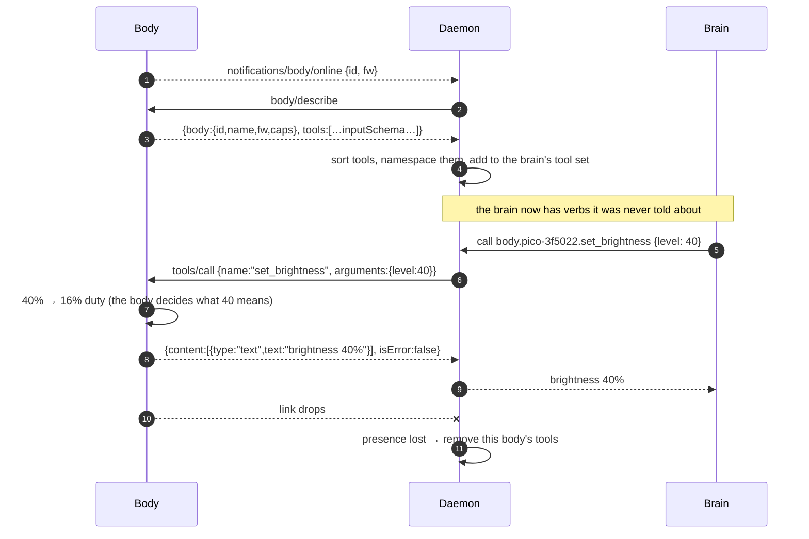
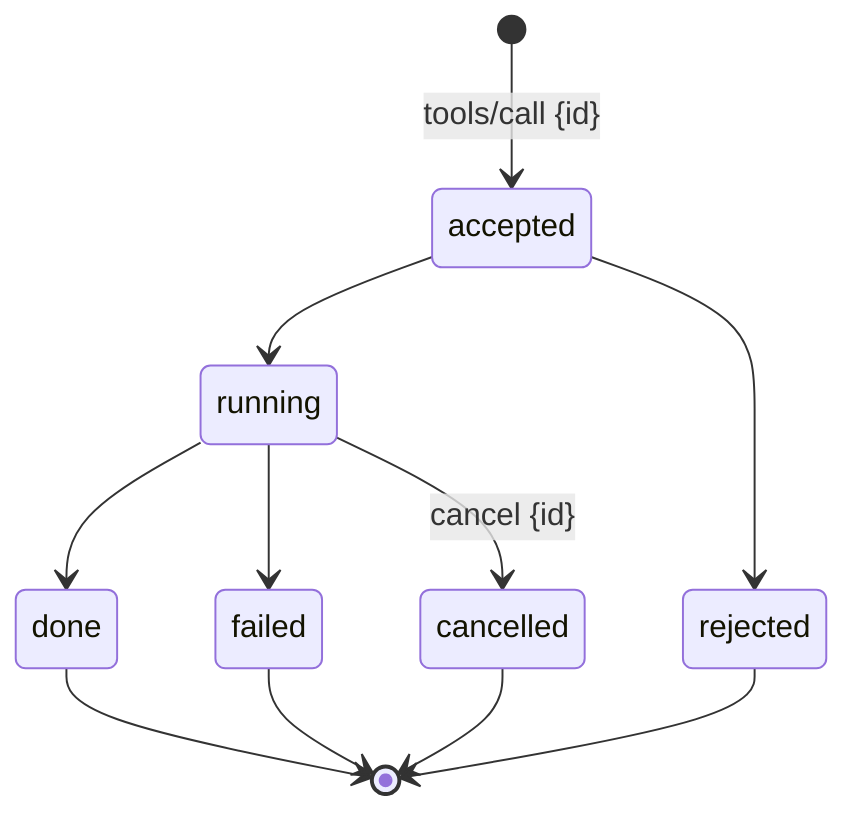

# The body contract

Everything a body must do to be driven by any brain. It is deliberately
small: five messages, one descriptor shape, and a handful of rules that
exist because ignoring them breaks something specific.

!!! success "Tested, not proposed"
    The v0 contract on this page was implemented twice — in C on the
    pico-sdk and in MicroPython — and driven from a host that had never met
    the board, over a bare USB cable with no broker and no configuration.
    See [experiment 001](https://github.com/jcarranz97/open-body-protocol/tree/main/experiments/001-pico-usb-body).
    Several rules below exist *because* of what that run showed.

## What a body is

Anything that renders the pet's presence or acts in the world and reports
what happened. A terminal window is a body. A Pico with one LED is a body. A
printed crab with eight servos and a screen on its back is a body.

A body is **not** defined by having hardware, and not by a transport. It is
defined by speaking this contract.

## The messages

Newline-delimited JSON-RPC 2.0, in both directions.



| Message | Direction | Purpose |
|---|---|---|
| `notifications/body/online` | body → daemon | Presence. Announced, not polled. |
| `notifications/body/offline` | body → daemon | Graceful departure, when there is time to send it. |
| `body/describe` | daemon → body | Identity, capabilities and tools, in **one round trip**. |
| `tools/call` | daemon → body | Invoke one verb. |
| `ping` | daemon → body | Liveness, where the binding cannot tell. |

**One round trip for description, not MCP's `initialize` + `tools/list`.**
Round trips cost on a serial link, and the 2026-07-28 MCP revision retired
that handshake anyway.

## Tool descriptors

MCP-shaped, so re-exposing a body [as an MCP server](mcp.md) is a relabelling
rather than a translation:

```json
{
  "name": "set_brightness",
  "description": "Set how brightly the indicator light glows, as a percentage. Use for mood: dim when calm, bright when alert.",
  "inputSchema": {
    "type": "object",
    "properties": {
      "level": {"type": "integer", "minimum": 0, "maximum": 100,
                "description": "0 is off, 100 is full."}
    },
    "required": ["level"]
  }
}
```

**The `description` is not documentation, it is the interface.** It is what a
model reads to decide whether this verb is the one it wants. "Use for mood:
dim when calm, bright when alert" does more work than the schema does.

### A restricted schema subset

Bodies emit only: `boolean`, `integer`, `number`, `string`, `enum`, with
`minimum`/`maximum` and `description`. **No nesting, no arrays of objects.**

This is not timidity — xiaozhi and Espressif's own MCP SDK arrived at the
same restriction independently, and for the same reason: **a builder must
never hand-write JSON Schema in C.** A firmware helper takes a name, a type
and a range, and synthesises the schema. That single decision is most of
what "easy to connect a body" means in practice.

### `userOnly` — the flag a schema cannot express

```json
{"name": "reboot", "description": "Restart the body.", "userOnly": true}
```

`wave` and `reboot` are different kinds of verb, and no amount of typing says
so. A `userOnly` tool is offered to a human interface and **withheld from the
brain's autonomous tool set** — borrowed from xiaozhi's `AddUserOnlyTool`,
and it matters far more once a verb moves an arm rather than an LED.

## Results, including failure

```json
{"content": [{"type": "text", "text": "brightness 40%"}], "isError": false}
{"content": [{"type": "text", "text": "level must be 0..100"}], "isError": true}
```

**A rejected call is a result, not a transport error.** Experiment 001 sent
`level=150` and `direction=sideways`; both came back as readable `isError`
results, which is what lets a brain say *"I can't turn that far"* instead of
hanging or emitting a stack trace. A body that crashes on bad input has
failed the contract even if its happy path works.

The same applies when the body is gone: the daemon returns a tool result
saying the body is not connected, never a 60-second timeout.

## Intents, not motor commands

A verb is something a person would say. `move(direction, distance_cm)`,
`wave_claw(side)`, `look_at(x, y)` — **never** `left_motor(pct, ms)`.

Three independent lines of evidence, all pointing the same way: every
shipped robot pet exposes verbs with joint access as a discouraged escape
hatch (Petoi's `kwkF`, XGO's `action(13)`, Vector's `pop_a_wheelie()`,
Reachy's `look_at` with joint control marked "not recommended"); every
LLM-plus-ROS project puts the model at supervisory rate over a classical
executor; and a tool call costs one round trip of model latency, which is
one to three seconds. Wheels cannot be driven at that rate.

**The body owns the how.** Experiment 001's smallest example: a request for
10% brightness becomes 1% duty cycle, because perceived brightness goes as
roughly the square root of duty. The brain named an intent; the body decided
what it meant in hardware. A body with a servo-driven shutter would decide
something entirely different, and nothing above it changes.

Reflexes belong to the body too — obstacle stops, end stops, a watchdog that
halts motion when the daemon goes quiet. A brain is allowed to be slow, and
is allowed to fail; a motor is not.

## Long actions

v0 is synchronous: call, act, reply. That is honest for a 200 ms blink and
wrong for a thirty-second walk across a desk.

v1 adds an id and a lifecycle — the one genuinely good idea in ROS actions,
bought as a convention rather than a dependency:



Designing the id in from the start is cheap; retrofitting feedback later
breaks every body already built.

## Presence

**Presence is an abstraction with a different implementation per binding.**
This is the one place where the elegant answer does not generalise, so it is
specified rather than assumed:

| Binding | A body is present when | It disappears by |
|---|---|---|
| MQTT | a retained message sits on its presence topic | Last Will publishes an **empty payload**, clearing the retained message |
| stdio / subprocess | the process is running | the process exits |
| serial / USB | the port is open and answers | unplugging, or `ping` going unanswered |
| in-process | the module is loaded | it is unloaded |

The MQTT form is the nicest — no heartbeat table, no TTL sweeper, and after
a daemon restart the broker replays current truth — and it is stolen from
EMQX's MCP-over-MQTT binding, which is otherwise dormant.

**When a body goes, its tools go.** They are removed from the brain's tool
set rather than left to fail on call. A brain that cannot see `wave_claw`
does not try to wave.

## Rules the daemon must follow

Three of these come directly from experiment 001, which is why they are here
rather than in a style guide.

1. **Sort tools deterministically.** Never trust the body's ordering. Two
   firmwares of the *same* body disagreed — MicroPython's dictionaries do not
   preserve insertion order, so the firmware cannot fix its side. MCP's
   current revision recommends stable ordering because a reshuffled tool
   array **busts the model's prompt cache**; on an agent that runs warm all
   day, reflashing a body would silently start costing full-price prompts.
2. **Key identity on the board, not the firmware.** Both firmwares reported
   `pico-3f5022`, because both read the same hardware id. A registry keyed
   this way survives reflashing and even a change of language.
3. **Namespace tools per body** — `body.<id>.<tool>` — and register each body
   as its own unit. The current MCP revision requires a server's tool set not
   to vary per connection, so one-body-one-server is the clean modelling.
4. **Capability gating is the body's business.** A plain Pico advertises
   `set_brightness` because its LED is on GPIO 25; a Pico W does not, because
   its LED hangs off the wireless chip. Same source, different board,
   different tool list. The daemon learns this by asking, never by
   configuration.
5. **Media never rides the tool channel.** Audio and images take their own
   path; a tool call triggers capture and returns a small result or a handle.
   Both xiaozhi and EMQX's reference companion converged on this, and EMQX
   measured what happens otherwise: ~3 s round trips and no barge-in.

## Implementing a body

Five things, and nothing else is required:

1. Announce presence with a stable id derived from the hardware.
2. Answer `body/describe` with honest `caps` and tools whose schemas match
   what the hardware can actually do.
3. Execute `tools/call`, and return a readable result — including failures.
4. Own the how: kinematics, timing, safety, reflexes.
5. Keep working when the daemon is gone.

A terminal, an ESP32, a Pico, a ROS 2 robot behind a bridge, and a commercial
product that adopts the contract are all the same five things.

## What a body must never do

- Compute authoritative state, or resist being overwritten.
- Invent a verb it cannot perform, or claim a capability it lacks.
- Hold credentials beyond its own connection.
- Accept raw actuator commands from the brain.
- Crash on malformed input.
