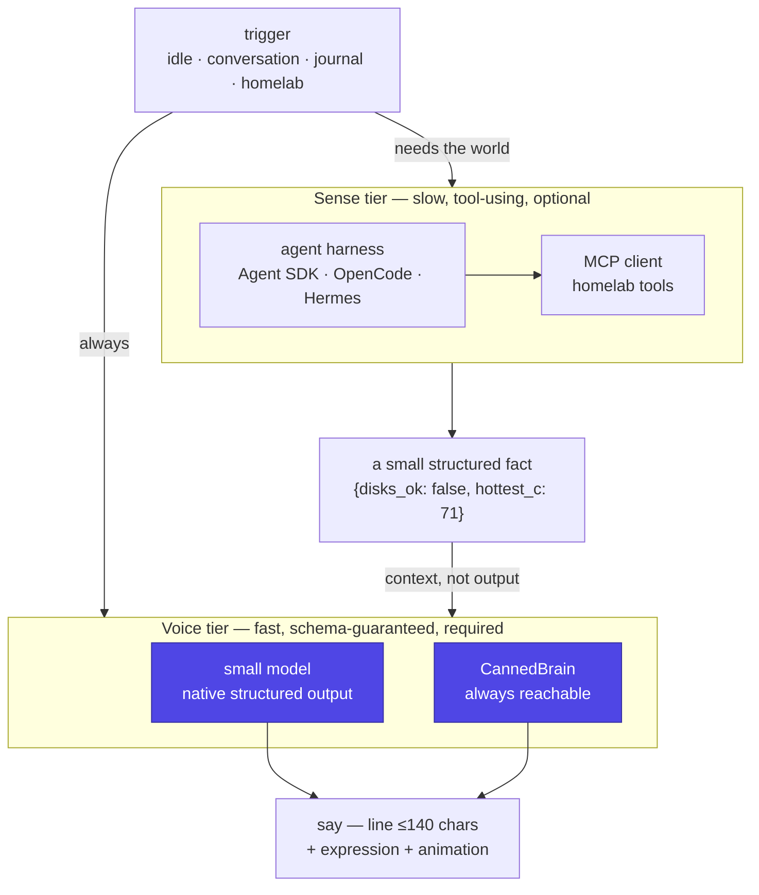
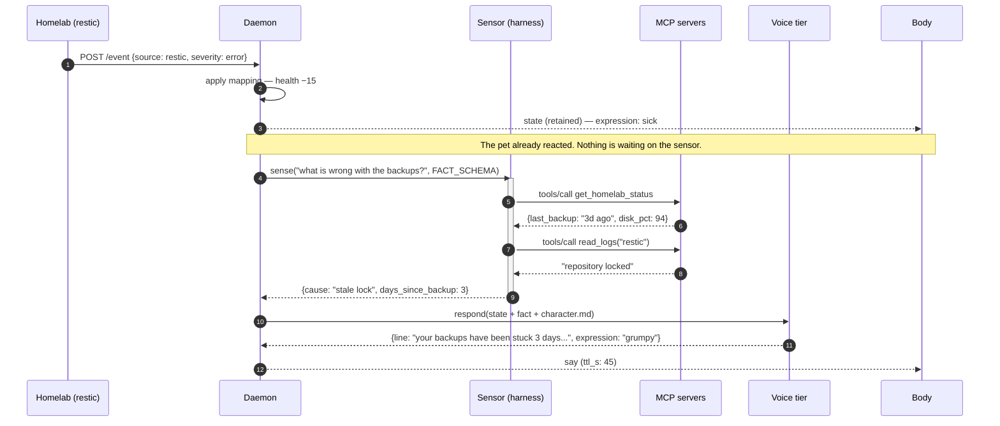

# Brain

The pluggable layer that turns a trigger and some context into one small JSON
object. It is the only place in the system where a language model appears,
and it is designed so that the rest of the pet cannot tell which model — or
whether any model at all — is behind it.

!!! abstract "The design rule"
    **The pet must never know which model is thinking for it, and must never
    wait on one.** The brain is a component behind a narrow interface, and the
    canned-line table is always available as the zeroth provider.

## Two tiers: the voice and the senses

The single most important decision on this page is that these are **not the
same component**, even though both involve a model.



**The voice tier is the pet talking.** It is required, it is on the critical
path, and its budget is a couple of seconds. A small model with native
structured outputs answers it for a fraction of a cent, and `CannedBrain`
answers it when nothing else can.

**The sense tier is the pet finding something out.** It is optional, it is
never on the critical path, and it may take ten seconds because nobody is
waiting: it produces a *fact*, which becomes context for the voice tier on
the next utterance. This is where an agent harness, tool calling and MCP
belong (FR-140).

Collapsing the two — routing every idle chirp through an agent loop — is the
mistake this design exists to avoid. A harness is optimised for long,
exploratory, many-turn work; a pet needs eleven words now. Ask a harness for
eleven words and you pay for a large system prompt, a tool-definition block
and a loop that may decide to take four turns, on the *most* expensive
provider you have (FR-141).

## The abstraction

The pet does not need "an LLM". It needs *one small JSON object*. That is a
narrow enough contract that any model from Qwen 2.5 3B upward can satisfy it,
which is exactly why it is the contract (FR-070).

```python
@dataclass
class Capabilities:
    structured: str      # none | json_mode | json_schema | grammar | native_strict
    tools: bool
    context_tokens: int
    latency_class: str   # fast | slow | agentic
    cost_class: str      # free | cheap | paid
    privacy: str         # local | cloud

class Brain(Protocol):
    name: str
    caps: Capabilities
    def respond(self, ctx: PetContext) -> PetResponse: ...

class Sensor(Protocol):
    """Sense tier. Returns a fact, never an utterance."""
    name: str
    caps: Capabilities
    def sense(self, question: str, schema: dict) -> dict: ...
```

`latency_class` has three values, not two, because `slow` already means "a
14B model on CPU" at 15 s. An agentic turn is a different order of magnitude
and gets its own budget (FR-142).

Three implementations cover essentially the whole world:

| Implementation | Covers |
|---|---|
| `CannedBrain` | Static line table keyed by `(mood, expression)`. No network. **Always the final fallback.** |
| `OpenAICompatBrain` | Ollama, llama.cpp server, vLLM, LM Studio, LocalAI, plus OpenAI, Groq, Together, DeepSeek, Mistral, OpenRouter — anything speaking `/v1/chat/completions` |
| `AnthropicBrain` | Native Messages API, for guaranteed-schema structured outputs, prompt caching and MCP tools |

### Why two cloud paths rather than one

Anthropic publishes an OpenAI-compatible endpoint, so in principle
`OpenAICompatBrain` could cover both. It is framed as a way to test and
compare rather than as a production path, and the gap that matters here is
**guaranteed schema conformance**: on the compatibility endpoint the `strict`
parameter for function calling is ignored, so tool-use JSON is not guaranteed
to match the schema. The native API's structured outputs
(`output_config.format`, and `strict: true` on tool definitions) are what
make the guarantee.

Other gaps on the compatibility endpoint: no prompt caching, no audio input,
system messages hoisted and concatenated (the native API takes a single
leading system message), and temperature capped.

So: `OpenAICompatBrain` for local models and cheap cloud tiers,
`AnthropicBrain` when the guarantee is wanted. One extra class, ~80 lines.

## Reliable JSON from small models

This — not the HTTP plumbing — is the real engineering problem. A 7B model
*will* emit prose, markdown fences and trailing commas if you merely ask
nicely. Use constrained decoding; every serious runtime supports it (FR-072).

| Runtime | Mechanism |
|---|---|
| Ollama | `format` = your JSON Schema |
| llama.cpp server | GBNF grammar |
| vLLM | guided decoding (xgrammar / outlines) |
| Claude native | structured outputs (`output_config.format`) |
| Anything else | ask for JSON, repair-and-retry once, then fall back |

The pipeline is the same for every provider, without exception:

```text
constrain → parse → validate against schema → clamp enums → on any failure, CannedBrain
```

**Clamping matters as much as validating.** A model that returns
`expression: "smug"` is not an error to surface; it is an expression the
firmware has no sprite for. Clamp to the nearest legal value, log it, carry
on. The device gets a face either way.

!!! warning "The schema will not enforce the 140-character limit"
    Constrained decoding covers *shape* — keys, types, enums. It does not
    cover **`maxLength`**, `minLength`, `pattern` or numeric bounds: those
    are silently stripped by the providers and, at best, folded into a
    field description and validated client-side after generation.

    So `line` being ≤140 characters is **the daemon's job, not the
    schema's** (FR-143). Put the limit in the prompt, keep it in the schema
    description for the model's benefit, and then clamp it yourself — one
    retry, then truncate on a word boundary. A `line` that arrives at 400
    characters is a normal Tuesday, not an incident.

## Routing

Different jobs deserve different models. Route by trigger, not by preference
(FR-073).

| Trigger | Tier | Why |
|---|---|---|
| Idle chatter, mood transitions | **local** | Free, private, unlimited; quality barely matters for 12 words |
| Owner conversation (Telegram, voice) | **cloud** | This is the moment the pet earns its existence |
| Daily journal, memory writes | **cloud** | Long-lived artefacts; worth the tokens |
| External event reactions | **local** | Templated and frequent |
| Anything, when the primary fails | **canned** | Never blocks |

The `homelab` trigger keeps its name because that is the archetypal source,
but it fires for anything that posts to the webhook — a git hook on a laptop
counts ([integrations](integrations.md#external-events)).

Config, not code:

```yaml
providers:
  local:
    kind: openai_compat
    base_url: http://ollama.dev.lan:11434/v1
    model: qwen3:8b
    caps: { structured: json_schema, tools: false, privacy: local, cost_class: free }
  cloud:
    kind: anthropic
    model: claude-opus-5
    caps: { structured: native_strict, tools: true, privacy: cloud, cost_class: paid }

routes:
  idle:         [local, canned]
  conversation: [cloud, local, canned]
  journal:      [cloud, canned]
  homelab:      [local, canned]

sensors:                     # the sense tier — optional, absent by default
  homelab:
    kind: agent_sdk          # agent_sdk | opencode | openai_compat
    caps: { latency_class: agentic, tools: true, privacy: cloud }
    timeout_s: 60
    ask_on: [homelab, conversation]   # never `idle`
```

Going 100% local for privacy, or 100% cloud while the GPU is busy, is then a
YAML edit and a restart. Every chain ends in `canned` — the loader should
refuse to start if one does not (FR-074).

**`sensors:` is a separate key from `providers:` on purpose.** A sensor can
never appear in a `routes:` chain, because a route chain is the thing the
device is waiting on. That separation is what makes "make it more powerful"
a configuration change rather than a redesign: delete the `sensors:` block
and the pet is exactly the pet it was, just less well-informed.

!!! note "The local tier is optional, and often absent"
    A local model server is a *nice* thing to have and a poor thing to
    require: many hosts have no GPU, and plenty of setups outsource
    inference entirely. Nothing breaks when `local` is unreachable, because
    a route is a chain — `idle: [local, canned]` with nothing listening on
    `local` is a pet that uses canned lines for idle chatter, which is what
    it would mostly do anyway. Set `providers:` to what you actually run.

Model IDs are config values and change over time. Current Anthropic IDs are
`claude-opus-5`, `claude-sonnet-5` and `claude-haiku-4-5`; the daemon never
hardcodes one.

## The sense tier

A sensor answers a question about the world and returns a **fact**, in a
schema the daemon defines. It never writes the pet's line, never picks an
expression, and never talks to a body.



Read step 3 carefully: **the pet reacts before the sensor answers.** The
webhook already moved `health` and published a `sick` face; the sensor only
decides what the pet says *about* it, seconds later. If the sensor times out,
the pet still got upset — it just says something vaguer (NFR-019).

### Which harness

| Option | Structured output | Local models | Deployment | Verdict |
|---|---|---|---|---|
| **Claude Agent SDK** | Native, first-class | **No — Claude only** | Python package, spawns a bundled CLI subprocess | **Start here.** Python-native, in-process MCP servers, and a warm client amortises the subprocess away |
| **OpenCode** | Claimed; verify | **Yes** — Ollama, LM Studio, any OpenAI-compatible base URL | `opencode serve`, OpenAPI spec at `/doc`, no official image | Take it if provider independence or fully-local inference outranks polish |
| **Hermes** | **None found** | Yes, ~37 providers | Docker, already in the homelab | A cheap spike — it drops into `OpenAICompatBrain` with only a `base_url` |
| **Plain API + MCP client** | Native | Yes | Nothing to deploy | The dark horse, and possibly the right answer — see [MCP](mcp.md) |

Three findings that decide this, all of them non-obvious:

- **A harness may not own the persona.** Hermes layers a `system` message *on
  top of* its own core prompt by design, so the agent keeps its tools and
  skills. Your `character.md` becomes an appendix to a coding-agent prompt —
  survivable for a sensor, disqualifying for the voice.
- **A harness may not guarantee a schema.** Hermes' API server exposes no
  `response_format`, `json_schema` or `strict` surface, which puts you back on
  "ask for JSON and retry" — the weakest row in the table above, on the most
  expensive provider.
- **A harness inherits its host's trust.** If you take the Claude Agent SDK,
  `setting_sources=[]` is mandatory: otherwise a session loads hooks from the
  working directory's settings file and connects the servers in its
  `.mcp.json` with no trust prompt. A daemon that runs in a directory it did
  not author must not do that (NFR-020).

You do not need any of them to reach MCP servers, which is the point of the
[MCP page](mcp.md).

## Portability details that actually bite

- **System prompts.** Keep `character.md` vendor-neutral. Each provider gets
  a small adapter for its quirks — the Anthropic API takes a single leading
  system message; some local chat templates want the persona in the first
  user turn to be respected at all.
- **Tools.** Normalise definitions to plain JSON Schema and translate per
  provider. Small local models are bad at tool use — **do not give them
  tools.** Pre-fetch what they need instead (state, top memories, recent
  journal) and hand it over in the prompt.
- **Token accounting.** Providers report usage differently. Normalise to
  `{in, out, cost_eur}` at the adapter boundary so the budget guard works
  regardless of who answered (FR-076).
- **Latency.** A pet tolerates 2–5 s far better than a chatbot does — show a
  thinking animation. But a 14B model on CPU can take 30 s. Hard timeout per
  class, then fall through (NFR-002, NFR-018):

  | `latency_class` | Timeout | Used by |
  |---|---|---|
  | `fast` | 8 s | Local models, small cloud models — the voice tier |
  | `slow` | 15 s | Large cloud models |
  | `agentic` | 60 s | The sense tier only, never the voice |

## Budget discipline

Do **not** call the brain on every tick. Call it on:

- an inbound voice or Telegram message (always),
- a mood **transition**, not every tick spent in that mood,
- a neglect threshold crossing (4 h, 12 h, 24 h),
- one daily journal entry at 21:00,
- a homelab webhook event.

Rate limit: at most 1 spontaneous call per 15 minutes, at most ~40 per day
(FR-075). Everything else uses the canned table. Every call is logged with
its normalised cost, because "is this pet expensive?" should be a query, not
a feeling.

## Prompt layout

```text
character.md          ← stable personality, voice, hard rules
+ memory (top 20)     ← facts learned about the owner
+ recent journal (3)  ← last few days, one line each
+ current state JSON  ← from the protocol page
+ trigger description ← "neglected 12h" / "owner said: ..."
```

The first block is stable across every call, which is what makes prompt
caching worth enabling on the cloud tier: keep `character.md` first and
byte-identical, and put the volatile state and trigger last.

## Structured output

Ask for JSON only — no prose, no fences:

```json
{
  "line": "max 140 chars, in character, lowercase, no emoji",
  "expression": "one of: idle|happy|sad|angry|sleepy|sick|excited|confused",
  "animation": "one of: none|bounce|shake|wobble|spin",
  "sound": "one of: none|chirp_up|chirp_down|alarm|purr",
  "remember": null,
  "mood_nudge": 0
}
```

`remember` lets the pet write a durable fact about its owner. `mood_nudge`
(−10..+10) lets it tweak its own `social` stat, so the personality has *some*
feedback into the simulation — bounded, so it can colour the pet's mood but
never drive it. Everything else in the simulation stays untouchable by the
brain (FR-071).

`line` is capped at 140 characters for two reasons: it is the width a small
screen can show in a few seconds, and it is what fits in one BLE MTU in v2.

## Tools — cloud tier only

Expose the pet's world as tools, defined once as plain JSON Schema and
translated per provider:

- `get_pet_state()`
- `recall(query)` / `remember(fact, weight)`
- `set_expression(expr, animation)` — lets it emote mid-turn
- `send_telegram(text)`
- `get_homelab_status()` — uptime, last backup, disk usage
- `read_journal(days)`

This is what turns it from a chatbot with a sprite into something that feels
continuous.

Implement them as an **MCP server** rather than inline function definitions —
and, separately, be an MCP **client** of the homelab's own servers. Those are
two independent capabilities and the daemon wants both; they have their own
page ([MCP](mcp.md)).

Two consequences worth stating here, because they constrain this section:

- **Expose pet state as a tool, not a resource.** `get_pet_state()` reads
  like a resource, but the hosted MCP connectors are tools-only, so a
  resource would be invisible to a whole class of consumer.
- **A pet MCP server cannot borrow the consumer's model.** Server-initiated
  sampling was deprecated in the 2026-07-28 spec revision, so the idea of an
  agent's own model voicing the pet is closed. **Generation stays in this
  process, permanently** — which is a good outcome, since it is the only way
  `character.md` and the fallback chain stay in charge.

For the local tier: no tools at all. Pre-fetch state, top memories and recent
journal into the prompt and let the small model just write a line.

## The eval harness

Build it in Phase 3, alongside the first real provider. It is what makes
provider-swapping *safe* rather than a vibe check (FR-077).

- 30 golden `(state, trigger)` fixtures in a YAML file.
- Run all of them against any configured provider.
- Score mechanically: valid JSON? enums in range? `line` under 140 chars? no
  emoji if forbidden? in character (a cloud model can judge this one)?
- `make eval provider=local` prints a table.

Now *"can Qwen 3 8B run my pet?"* is a question with an answer, and a new
model can be adopted the week it ships without regressions.
