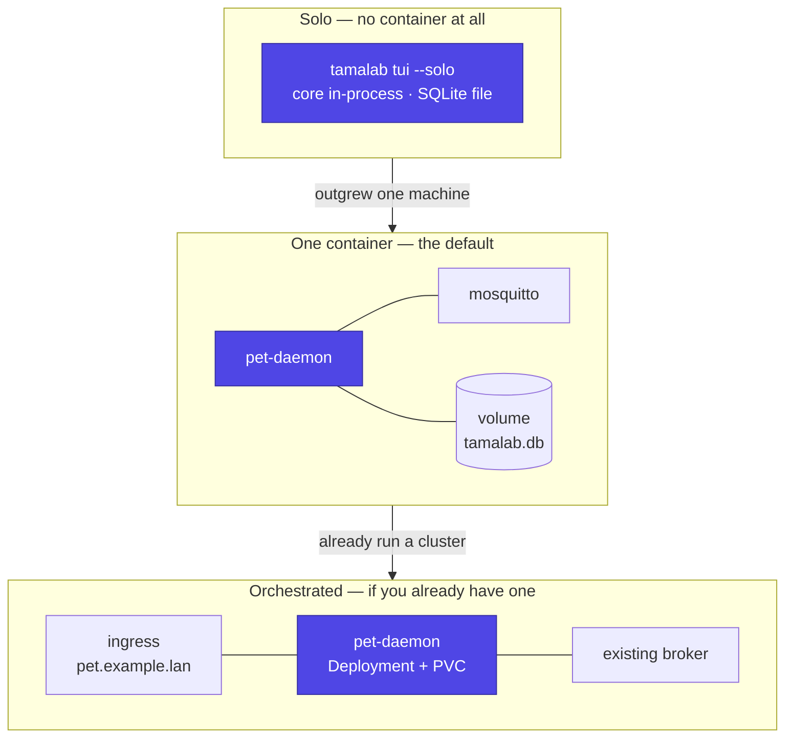
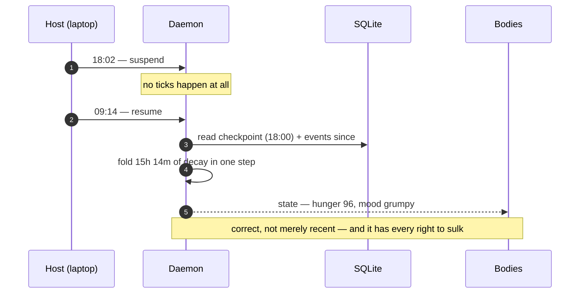
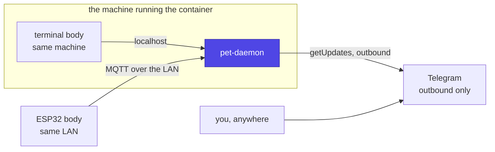

# Deployment — where the daemon runs

The daemon is **one container with one writable volume**. That is the whole
requirement. It runs on a laptop, a spare mini PC, a Raspberry Pi, a NAS, or
a homelab cluster, and the pet is identical in every case (FR-160).

A homelab is a *nice* place to put it — always on, already backed up, already
running the things the pet has opinions about — but it is an option, never a
prerequisite. Nobody should need a rack to keep a Tamagotchi alive.

## Three shapes, one image



| | Solo | One container | Orchestrated |
|---|---|---|---|
| Needs Docker | No | Yes | Yes, plus the orchestrator |
| Needs a broker | No | Bundled in the compose file | Yours, or bundled |
| Hardware body | No | Yes | Yes |
| Telegram | No | Yes | Yes |
| Survives closing the laptop | No | If the host is always on | Yes |
| Command to start | `uvx tamalab tui --solo` | `docker compose up -d` | `kubectl apply -f` |

**One image serves all three** (FR-164). Moving between them is a matter of
where the volume lives and which adapters are enabled — never a different
build, and never a different simulation.

## The default: one command

```yaml
services:
  broker:
    image: eclipse-mosquitto:2
    volumes: ["./mosquitto:/mosquitto/config"]
  tamalab:
    image: ghcr.io/jcarranz97/tamalab:latest
    depends_on: [broker]
    environment:
      TAMALAB_BROKER: mqtt://broker:1883
      TAMALAB_TZ: Europe/Madrid          # the sim sleeps 23:00–07:00 local
    volumes: ["tamalab-data:/data"]
volumes: { tamalab-data: {} }
```

**A broker ships in the reference compose file** (FR-163). Requiring people
to stand up Mosquitto before they can have a pet would lose most of them at
step one, and a broker with one publisher and two subscribers costs a few
megabytes. If you already run one, point `TAMALAB_BROKER` at it and delete
the service.

Everything else is optional. With no `TELEGRAM_BOT_TOKEN` there is no
Telegram; with no `providers.yaml` the pet speaks canned lines; with no
device on the network the terminal body is the only face. **A default install
with zero configuration and zero API keys is a working pet** (NFR-023).

## What it needs from the host

| Resource | Floor | Note |
|---|---|---|
| CPU | One core, mostly idle | A tick is a few arithmetic operations a minute |
| RAM | ~256 MB | Python and SQLite. A *local model* is not included and is the one thing that changes this |
| Disk | ~1 GB | The database is small; the event log grows slowly and is never compacted |
| Architecture | x86-64 and arm64 | A Raspberry Pi 4 is a fine host (FR-161) |
| Network | Outbound only | No inbound port from the internet is ever required (FR-162) |

The pet is not a demanding tenant. If a machine can run Home Assistant or a
Pi-hole, it can run this with room to spare.

## Running it on a machine that sleeps

A laptop is a legitimate host, and it is also the case that would break a
naively written simulation: close the lid at 18:00, open it at 09:00, and a
tick-counting pet has either missed 900 ticks or died.

**This design is already immune**, because decay is computed from elapsed
time rather than accumulated ticks ([simulation](simulation.md)):



The only thing a sleeping host loses is *punctuality*: a nudge scheduled for
21:00 fires when the machine wakes, or not at all if the window has passed.
That is a property to document for the owner, not a bug to engineer around —
and it is the strongest argument for a small always-on host if the pet is
meant to feel like a creature with its own life rather than an app.

## Where the bodies are



- **Terminal body** — same machine, or any machine that can reach the broker.
- **Device** — same LAN. This is the only body that constrains where the
  container runs: the ESP32 must be able to reach the broker, so a daemon on
  a work laptop behind a corporate network is a poor host for a hardware pet.
- **Telegram** — outbound long-polling, so it works from anywhere, including
  behind CGNAT, with no port forwarding and no dynamic DNS.

**Nothing here requires exposing anything to the internet.** Telegram is
outbound; MQTT is LAN-local; the terminal is local. That property is worth
defending — it is what lets someone run this on a home router's network
without thinking about security at all.

## If you do have a homelab

Then the daemon is one more workload, and two details from a real k3s
deployment are worth knowing because they are not obvious:

- **MQTT over WebSocket routes through an HTTP ingress.** If the cluster's
  ingress speaks HTTP only — Traefik, in the common k3s default — a plain
  MQTT listener needs TCP routing that may not be configured. MQTT over
  WebSocket is HTTP-shaped and goes through the existing ingress like any web
  app. It is the same trick [roaming](roaming.md) recommends for v2.
- **Reach agents by egress, not ingress.** An agent container is often
  deliberately unreachable — no Service, no inbound policy. Rather than
  opening it up, expose the pet's [MCP server](mcp.md) and let the agent
  reach *out* to it, selected by namespace and pod labels rather than by IP.

Storage is the usual single-node caveat: with a node-local volume provisioner
the pet's database lives on whichever node it first landed on, so pin it
there. **A pet that reschedules onto a fresh volume has amnesia**, which is
worse than downtime.

## Backup — the one operational thing that matters

The pet is a SQLite file. Copy it and you have copied the pet: its age, its
memories, its journal, its streak.

There is no cluster, no replication and no export format because there is
nothing to export *to* — but that also means a lost volume is a permanently
dead pet, and no amount of reflashing a device brings it back
([overview](overview.md)). Whatever the host, the volume belongs in whatever
backup already exists on that machine, and if none does, this is a good
reason to start one.
