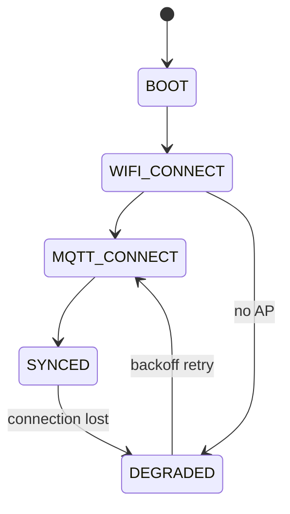

# Firmware

The ESP32-S3 side. It renders a face, reads inputs, streams audio and caches
one JSON blob. It computes nothing anyone would miss.

## Tasks (FreeRTOS)

| Task | Prio | Job |
|---|---|---|
| `net` | 2 | WiFi + MQTT keepalive, reconnect backoff |
| `ui` | 3 | 30 fps render loop, sprite animation |
| `input` | 3 | Debounced buttons, PTT edge detect, IMU shake |
| `audio` | 4 | I2S in/out DMA, WS audio session |
| `sim` | 1 | Local mood decay, offline mode only |

`audio` gets the highest priority because **a dropped display frame is
invisible and a dropped audio frame is a click**. Give it its own core on the
S3 where possible.

`sim` is the lowest priority and the least important task in the system: it
exists so a disconnected pet still looks alive, and its output is discarded
the moment the server speaks.

## State machine



**DEGRADED is a feature, not an error path** (FR-041). On disconnect the
device keeps the last state from NVS, keeps animating, runs the slow local
decay and shows a small disconnected glyph. User events go into a ring buffer
(~32 entries) and flush on reconnect — which is why events carry ULIDs and a
`clock_confident` flag ([protocol](protocol.md)).

It renders from NVS *before the network is up*, so the pet is on screen
roughly a second after power, not after a WiFi association.

In v1 this is a nicety. In v2 it is the normal state of the world, which is
why it ships in Phase 1 rather than "when we need it".

## Persistence

Store the last `state` JSON in NVS on every change, **throttled to once per
30 s** to save flash wear. The throttle is not an optimisation — a stat that
changes every tick would otherwise write ~1,400 times a day, and NVS is rated
in the tens of thousands of erase cycles per sector.

Nothing else is persisted. No history, no memory, no credentials beyond what
provisioning needs. The device is replaceable by design.

## The Transport interface

The single highest-leverage decision in the design (FR-061):

```c
typedef struct {
    bool (*connect)(void);
    bool (*send)(const char *topic, const uint8_t *payload, size_t len);
    void (*on_message)(transport_msg_cb cb);
    bool (*is_connected)(void);
} transport_t;
```

v1 has exactly one implementation, `MqttTransport`. v2 adds `BleTransport`
and **nothing above that line changes** ([roaming](roaming.md)). Writing the
interface costs an afternoon now; retrofitting it means touching every call
site later.

The same reasoning applies to the audio session, which is a second transport
with a different shape — that one is WSS in v1 and simply absent in v2, since
the keychain is a silent body.

## Rendering

The device owns the art. The server sends an `expression` id, an `animation`
id and a `mood`; the firmware maps those to sprites in flash and plays them
(FR-031).

| Concern | Where |
|---|---|
| Sprite bitmaps | Flash |
| Frame timing, easing, idle blinking | Firmware |
| Which expression, when | Server |
| Text of a line | Server (`say.line`, ≤140 chars) |

Idle behaviour — blinking, small drifts, the occasional look-around — is
firmware-local and needs no server round trip. It is also most of what makes
the thing read as alive between events, so it deserves more attention than
its line count suggests.

**A `say` whose TTL has expired is dropped on arrival**, silently. A device
that was unplugged overnight must not perform a backlog.

## Inputs

| Input | Event |
|---|---|
| 3 action buttons | `type: button`, `name: feed` / `play` / `clean` |
| Push-to-talk button (own GPIO) | Opens the audio session ([voice](voice.md)) |
| IMU | `type: shake` |
| Long press | `payload.hold_ms` — distinguishes a pet from a poke |

Debounce in firmware, not on the server. Every event gets a ULID and a
timestamp at the moment it happens, not at the moment it is sent.

## OTA

Do it in Phase 4, while the device is still a desk unit on a trusted LAN:
plain HTTP to a URL on the homelab, with the image's SHA-256 in the `cmd`
payload and verified before flashing (NFR-012).

It is trivial now and miserable later — and every subsequent phase gets
faster once a firmware update does not mean unplugging the pet.

## What the firmware must never do

- Compute authoritative state, or resist being overwritten by the server.
- Store secrets that matter — no Telegram token, no API keys.
- Open the mic outside LISTENING, or buffer audio in IDLE (NFR-010).
- Assume it is connected.
- Render sprite data sent from the server.
