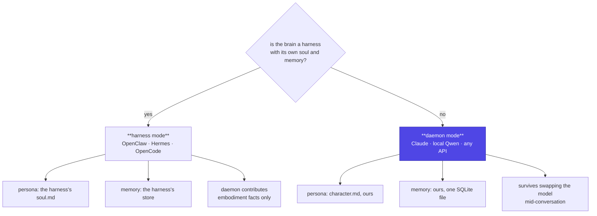

# Identity and memory

Who the thing *is*, and who remembers — with two brains in the room, this
needs deciding explicitly rather than emerging.

## The rule

> **If the brain is a harness, the harness owns identity. If the brain is a
> raw model provider, the daemon owns it.**

Both modes are supported. Neither is a fallback for the other. What is not
supported is both at once, because that is how the same creature ends up
remembering different things depending on which brain answered.



## Daemon mode

The default, and the one that makes the promise *"same character, any
brain"* true.

- **Persona** is `character.md`, injected as the system prompt.
- **Memory** is the daemon's, in the same SQLite file as everything else.
- **Swapping Claude for a local Qwen changes the quality of the replies and
  nothing else.** The thing remembers what it remembered.

Memory is a `remember(fact)` / `forget(query)` tool pair, injected into the
prompt above the persona. The wording of those tool descriptions is the
design — Reachy Mini's is worth reading before writing ours: *"Use this
silently in the background; acknowledge naturally without saying 'I will
remember that'."*

Their storage model is a flat 60-fact list with no retrieval, which is
honest about being a toy. A real layer wants scoring and recall; the
Apache-2.0 `ovos-memory-plugins` has six backends and is worth depending on
rather than reimplementing — **depend, never vendor**, since this repo is
MIT.

## Harness mode

A harness arrives with a persona and a memory store already. Competing with
them produces two characters wearing one body.

So the daemon stops holding the character and contributes only what the
harness cannot know:

```text
Embodiment context, injected per turn:
  You currently have a body: "printed crab, 8 legs, 2 claws, 128x64 screen".
  Verbs available right now: walk, turn, wave_claw, set_face, sleep.
  Last seen: 2 seconds ago.
```

That is it. The harness decides who is speaking; the daemon says what there
is to speak *with*.

**The cost is real and should be stated.** In harness mode:

- The character lives in someone else's format, and moving to another
  harness means porting it.
- Memory is theirs, with their retention rules and their storage.
- **Some harnesses layer a system prompt rather than replacing it** — Hermes
  does this deliberately, so a persona becomes an appendix to a large
  coding-agent prompt. A 140-character in-character reply is hard to get out
  of that.
- Prompt caching is theirs to lose.

## What the daemon owns in both modes

Some things are the daemon's regardless, because they are properties of the
*deployment* rather than the character:

| Owned by the daemon, always | Why |
|---|---|
| The body registry, keyed on hardware id | Survives reflashing, and even a firmware language change |
| Presence, and therefore which verbs exist | Only the daemon sees the bodies |
| The interruption budget and quiet hours | Otherwise every pack and every harness sets its own |
| The event log | The audit trail of what actually happened |

**Body identity is separate from character identity, and keyed differently.**
A body's id comes from its board; a character's comes from its persona file.
Swapping the crab for a Pico changes the verbs available, not who is
speaking — which is exactly the separation that lets one character move
between bodies.

## Switching modes

Changing `kind: anthropic` to `kind: harness` in the provider config changes
who owns the character, which is a bigger change than the diff suggests. It
should be a deliberate act with a visible warning, not a quiet consequence.

There is no automatic migration of memory between the two: exporting facts
from a daemon store into a harness's format is a per-harness problem, and
pretending otherwise would lose things silently.
