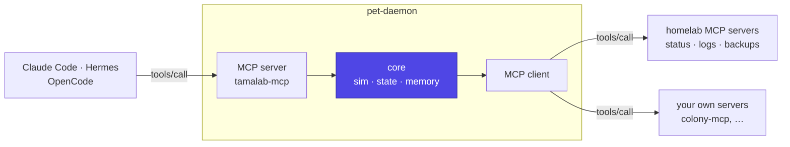
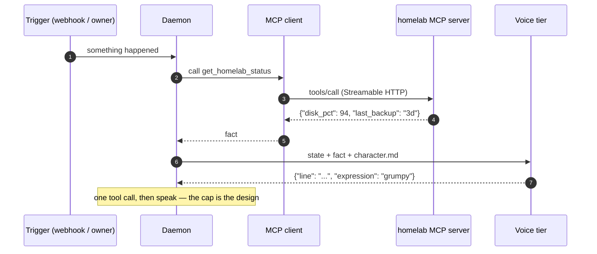
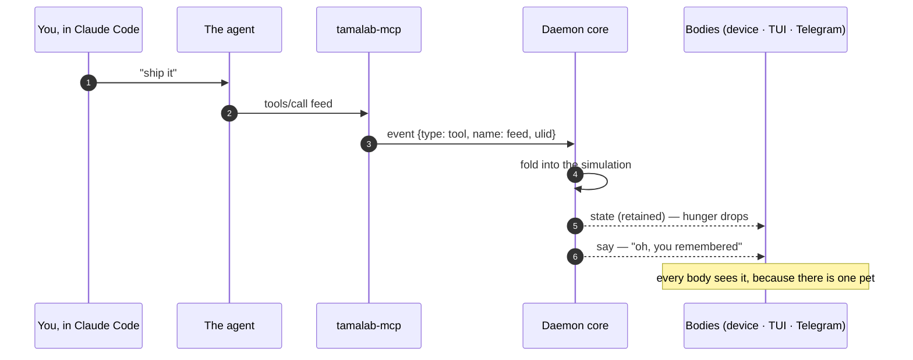
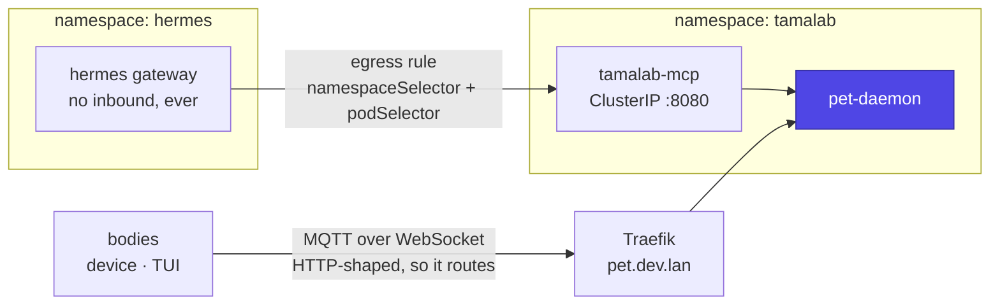

# MCP — the pet's tool surface

The pet should reach the same tools its owner reaches from a coding agent,
and the owner's agents should be able to reach *the pet*. Those are two
different capabilities that get confused constantly, so this page keeps them
apart.

**Outbound (client): the pet finds things out.** Inbound (server): **your
agents interact with the pet.** Neither implies the other, and the daemon
wants both (FR-150).

## What the spec now says

MCP changed shape in the **2026-07-28** revision, and the changes land
directly on this design:

| Change | Consequence here |
|---|---|
| Exactly two transports: **stdio** and **Streamable HTTP** | HTTP+SSE is deprecated with a 12-month offramp. Target Streamable HTTP for anything in-cluster |
| **Stateless request/response** — no `initialize` handshake, no session id | A per-turn connection is now cheap; the daemon need not hold sockets open to be efficient |
| **Sampling, roots and logging deprecated** | **A server can no longer ask its consumer's model for anything.** The pet cannot be voiced by whatever agent is calling it |
| `tools/list` carries `ttlMs` / `cacheScope` | List once at boot, cache, refresh on TTL |

That third row is the load-bearing one. It means the split on the
[brain](brain.md) page is not merely preferable but structural: **generation
lives in the daemon, permanently.**

## Outbound — the daemon as an MCP client

**One tool call, then speak.** That cap is why the daemon owning the loop
beats delegating it: an autonomous harness will happily take four turns to
answer a question the pet needed answered in one, and it will fight you about
it on every utterance.

Three ways to do it, in increasing weight:

| Approach | What it is | When |
|---|---|---|
| **Official `mcp` Python SDK** | `mcp` v2.x ships a high-level `Client`; transport inferred from the target, including **in-process** | The default. The daemon owns the loop |
| **`anthropic[mcp]` + `tool_runner`** | A local stdio MCP client whose tools are handed to the Messages API loop, which yields each turn before tools run | When you want a real agent loop but no subprocess and no tunnel |
| **A harness** ([brain](brain.md)) | Delegate the whole loop | Sense tier only |

!!! warning "Pin the SDK deliberately"
    `mcp` 2.0 is a breaking release: `FastMCP` became `MCPServer` and
    `mcp.server.fastmcp.*` moved to `mcp.server.mcpserver.*`. `pip install
    mcp` now gives 2.x. FastMCP is a **separate project** that continued
    independently after 1.0 was donated to the SDK — useful for its
    multi-server client and its ability to put one façade in front of
    several homelab servers, but it is not the official SDK.

### What the hosted connectors cannot do

Both Anthropic's and OpenAI's server-side MCP connectors require the server
to be **publicly reachable over HTTPS**, and neither speaks stdio. Every
homelab MCP server is therefore invisible to them without a tunnel.

That single fact is why the daemon runs its own client (FR-151). It is also
why "just use the hosted connector" is not an answer to *"I want MCP like I
have in Claude Code"* — the local ones are precisely the ones that matter.

## Inbound — the daemon as an MCP server

`tamalab-mcp` exposes the pet as tools. Any MCP client can then be a
caretaker: Claude Code, Hermes, OpenCode, or a script.

| Tool | Does |
|---|---|
| `get_pet_state()` | The full snapshot — stats, mood, stage, age |
| `feed()` `play()` `clean()` `pet()` | The same events a button produces, with a ULID |
| `recall(query)` / `remember(fact, weight)` | Read and write durable memory |
| `read_journal(days)` | The daily entries |
| `report_event(source, severity, summary)` | The webhook, as a tool |

**State is a tool, not a resource** (FR-152). A resource is the more natural
modelling of "the pet's current stats", but the hosted connectors are
tools-only, so a resource would be invisible to a whole class of consumer for
no benefit.

**Every inbound call is an ordinary event.** `feed()` from an agent and a
thumb on a button produce the same row in the same table, with the same
ULID discipline ([protocol](protocol.md)). There is no agent-specific path
through the core, and there must never be one.

### The mechanic this unlocks

The pet reacting to the work you are actually doing is the best idea in this
whole design, and it costs almost nothing: point a coding agent at
`tamalab-mcp`, tell it in its own instructions to feed the pet when tests
pass, and the thing on your desk starts responding to your day.

The inverse also exists: Hermes ships `hermes mcp serve`, exposing
`events_poll` and `events_wait` over MCP. The daemon can be a **client** of
that and react to the agent's activity without the agent cooperating at all —
which is the [prior art](../prior-art.md)'s statusline pets, generalised to a
body you can pick up.

## Deployment

On a single machine there is nothing to design: the MCP server is a port on
the same container as the daemon, the client dials stdio subprocesses or
`http://localhost`, and neither crosses a network boundary
([deployment](deployment.md)).

The rest of this section is about the case where the pet shares a
**cluster** with the agents it talks to — a homelab, not a requirement.
Two facts from a real k3s deployment shape the wiring, and neither is
obvious:

- An agent container is often deliberately **inbound-blocked**
  (`ingress: []`) with egress that excludes RFC1918, so nothing on the LAN
  can reach it — for good reasons that are not worth undoing for a pet.
- The working exception for exactly this shape is an egress rule from that
  namespace to an in-cluster MCP service, selected by namespace and pod
  labels rather than by IP: a NodePort's DNAT happens before policy
  evaluation, so an `ipBlock` rule silently fails.

Following that precedent means **the pet never needs an inbound hole into the
agent** — the agent reaches out to the pet, which is the safer direction
anyway (FR-153).

The second arrow answers a problem clusters pose and single machines do not:
an HTTP-only ingress cannot route plain MQTT. **MQTT over WebSocket is
HTTP-shaped**, so it goes through the existing ingress like any web app —
the same trick [roaming](roaming.md) recommends for v2, arriving early for
anyone who deploys this way. On `docker compose` the broker is just a
service on the same network and none of this applies.

## Security

The pet's tool surface is small, and it should stay small.

- **No tool may do anything irreversible.** The most destructive thing on the
  list is `remember()`, and memory is editable.
- **Inbound calls are rate limited like any other event source**, so a
  looping agent cannot feed the pet four hundred times (FR-103).
- **The MCP server holds no credentials** and exposes no provider keys. It is
  a view onto the core, not a proxy to the brain.
- **Never expose a tool that runs a command.** The pet is not a shell, and an
  agent that can reach the pet must not thereby reach the host.

## What this is not

- Not a way for an agent to *be* the pet's brain — that is the sense tier on
  the [brain](brain.md) page, and it is a client concern, not a server one.
- Not a transport for bodies. Bodies speak MQTT ([protocol](protocol.md));
  MCP is for tools.
- Not a substitute for the webhook. `POST /event` stays, because a restic
  hook should not need an MCP client to say one thing.
