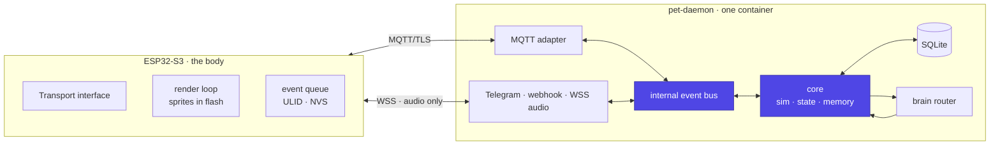

# Architecture Overview

Where the line between the body and the brain falls, and why. Every other
page in this section is a consequence of this one.

## The shape

Read it as three rings. The **core** knows about a pet, its stats and its
event log, and nothing about MQTT, Telegram or HTTP. The **bus** carries
events in and `state`/`say` out. Everything else is an **adapter** at the
edge, and adding one is additive: Telegram was the first, MQTT the second,
a BLE relay would be the third (v2), a web dashboard the fourth.

That layering is not decoration. It is what makes Phase 0 — a pet that is
playable on Telegram with no hardware at all — the same code as Phase 1
rather than a throwaway prototype (FR-002, FR-060).

## What runs where

| Concern | Device | Daemon |
|---|---|---|
| Authoritative stats, mood, age | — | ✔ |
| Event log, memory, journal | — | ✔ (durable) |
| Queue of unsent events | ✔ (ring buffer, NVS) | — |
| Sprites and animation | ✔ (flash) | — |
| Choosing *which* sprite | — | ✔ (`expression`) |
| LLM calls | — | ✔ |
| STT / TTS | — | ✔ |
| Local decay while offline | ✔ (prediction only) | ✔ (truth) |
| Secrets (bot token, API keys) | — | ✔ |

The device computes decay only as a *prediction* so the face keeps moving
while disconnected. On reconnect the server's state overwrites it silently —
there is no merge, ever (FR-023). The device's only real contribution is its
timestamped event log.

## Why MQTT for control

- **Retained messages.** The device gets the current state the instant it
  subscribes, with no request/response round trip and no bespoke "sync on
  boot" code path.
- **Last Will and Testament.** "The body went offline" comes free, on both
  sides — the daemon publishes its own LWT too, so the device can show a
  disconnected badge instead of pretending.
- **Pub/sub.** A second body, a web dashboard or a desk lamp that mirrors
  the mood costs nothing to add.
- **A tiny client.** The ESP32 footprint is small enough to leave room for
  audio buffers.

## Why not MQTT for audio

MQTT is a message bus, not a stream. Audio wants back-pressure, ordered
binary frames and a session that ends. Push-to-talk opens a WebSocket on
button-down and closes it after playback — roughly 200 ms of setup on a LAN,
hidden behind the first syllable ([voice](voice.md)).

This split — control over MQTT, audio over its own channel — is the same one
`xiaozhi-esp32` makes, and it is why the firmware puts a `Transport`
interface in front of both from day one (FR-061).

## The daemon's internals

One process, five concerns:

| Concern | Job | Notes |
|---|---|---|
| `sim` | 60 s tick; apply decay, derive mood, detect transitions | Pure function of time + events ([simulation](simulation.md)) |
| `store` | SQLite: `pets`, `events`, `memories`, `journal`, `devices`, `llm_calls` | One file, WAL mode |
| `bus` | Fan events in, fan `state`/`say` out | In-process; async queue |
| `brain` | Turn a trigger + context into one JSON object | Routed and rate-limited ([brain](brain.md)) |
| `adapters` | MQTT, Telegram, `POST /event`, WSS audio | The only code that knows a wire format |

**SQLite, not Postgres.** One pet, one owner, a write every 60 seconds and a
handful of reads. A database server would be more infrastructure than the
thing it stores. It is also what makes the daemon a single container with a
single volume, which matters for a project whose failure mode is *the owner
gets bored of operating it*.

**The device registry is a table from day one** (FR-062). v1 has one row.
Adding the keychain in v2 should be an `INSERT`, not a refactor — topics
already carry `<id>` and credentials are already per-device.

## The five v1 decisions that keep v2 cheap

All nearly free now, all expensive to retrofit. They are listed here because
they cut across every page.

1. **Abstract the transport in firmware** (FR-061). One implementation in
   v1, `MqttTransport`. `BleTransport` in v2 changes nothing above that
   line. The single highest-leverage decision in the design.
2. **Keep the daemon transport-agnostic** (FR-060). MQTT is an adapter, not
   a layer woven through the logic.
3. **Design payloads as if the MTU were 247 bytes** (FR-063). BLE will cap
   you there; the `state` JSON is ~400. Define the packed binary form now
   and write the JSON↔packed codec in Phase 1 even though v1 never sends it.
4. **Never let firmware assume it is connected** (FR-041). DEGRADED mode
   ships in Phase 1. In v1 it is a nicety; in v2 it is the normal state.
5. **Do not hardcode one device** (FR-062).

The one thing safely deferred is **power**: deep sleep, wake sources and
duty cycling touch only the firmware's main loop and disturb no protocol.

## Failure behaviour

The project's real quality bar is what happens when things are broken,
because a desk pet that goes blank when a container restarts stops being a
creature and becomes a status light.

| Broken | What the pet does |
|---|---|
| Daemon restarts | Device keeps animating from NVS, shows a disconnected glyph, queues events, flushes on reconnect |
| WiFi drops | Same, plus reconnect backoff |
| LLM provider down or slow | Falls through the route chain, ends at a canned line within the timeout |
| STT/TTS times out | Confused animation and a canned line — never a hang |
| Broker down | Device DEGRADED, daemon keeps simulating; state reconciles on reconnect |
| Device unplugged overnight | Stale `say` messages expire on `ttl_s`; no backlog replay |
