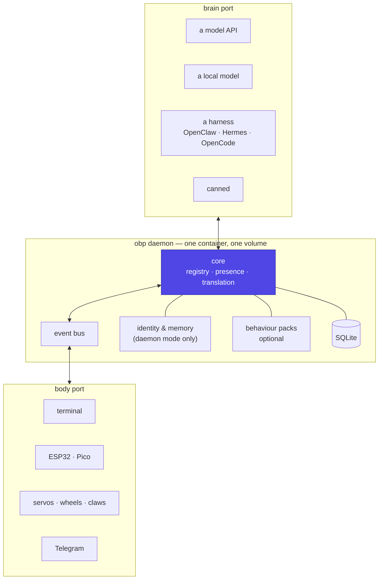

# Architecture overview

Two ports and a small daemon between them. Every other page is a
consequence of this one.

## The three rings

**The core** knows about bodies, their verbs, and which of them exist right
now. It knows nothing about MQTT, USB, Telegram or HTTP.

**The bus** carries events in and decisions out.

**Adapters** sit at the edge and are the only code that knows a wire format.
Adding one is additive: a serial adapter, an MQTT adapter, a Telegram
adapter, a BLE relay later.

That layering is what makes the [topologies](deployment.md) work. A body on
the end of a USB cable and a body across a Wi-Fi network reach the same core
through different adapters, and the core cannot tell which.

## What each side owes the other

| | The body promises | The brain promises |
|---|---|---|
| Describes itself | verbs with JSON Schema, honest capabilities | — |
| Accepts | intents, at conversational rate | context, including what verbs exist |
| Returns | a readable result, success or failure | a short decision, validated |
| On failure | keeps its reflexes, keeps working | falls through to the next provider |
| Never | invents a verb, takes raw motor commands | assumes a body exists |

The last cell in each column is the load-bearing one. **A body must work
when the brain is gone** — it keeps its reflexes and its local behaviour.
**A brain must work when no body exists** — the terminal-only install is not
a degraded mode, it is the common case.

## What the daemon owns

Deliberately little, and all of it is the part that would otherwise be
duplicated in every brain and every body:

| Concern | Why it is here |
|---|---|
| **Body registry**, keyed on hardware id | Survives reflashing and firmware language changes ([experiment 001](https://github.com/jcarranz97/open-body-protocol/tree/main/experiments/001-pico-usb-body)) |
| **Presence** | Only the daemon sees all the bodies; when one goes, its verbs go with it |
| **Translation** | Body verbs become brain tools, in whatever dialect that brain speaks |
| **Identity and memory** | In daemon mode only — a harness that has its own keeps it ([identity](identity.md)) |
| **The interruption budget** | Otherwise every pack and every harness invents its own |
| **The event log** | The record of what actually happened |

**SQLite, not a database server.** One file, one volume, and the deciding
argument is [deployment](deployment.md): a server process would put a floor
under where this can run, and a Raspberry Pi is a supported host.

## Why the body describes itself

The alternative — a catalogue of known device types in the daemon — fails
the moment someone builds something nobody anticipated, which is the entire
premise.

So a body arrives and says what it can do, with schemas. The daemon sorts
the verbs deterministically, namespaces them per body, and hands them to
whichever brain is connected. **Nobody teaches the daemon what a claw is.**

This has been tested rather than assumed: a Raspberry Pi Pico, in two
firmware languages, describing five verbs to a host that had never met it,
over a bare USB cable with no broker and no configuration
([body contract](body-contract.md)).

## Failure behaviour

The real quality bar, because a thing that goes blank when a container
restarts is a status light rather than a companion.

| Broken | What happens |
|---|---|
| Daemon restarts | Bodies keep their local behaviour; presence re-establishes; retained state replays where the binding supports it |
| A body unplugs | Its verbs leave the brain's tool set; a call already in flight returns a readable "not connected" result, never a hang |
| The brain is slow or down | Falls through the provider chain, ending at canned. No user-visible path blocks on a model |
| A harness changes its API | Only the harness adapter breaks; bodies and packs are untouched |
| No body at all | The terminal install works completely |
| No network at all | An all-in-one deployment is unaffected — model, daemon and actuators are on one box |

## The decisions that keep this cheap to extend

1. **Transport is a binding.** MQTT is one adapter, not the architecture. A
   USB body must never need a broker.
2. **The body owns the how.** Intents in, execution and safety local.
3. **Bodies are one-per-registry-row from day one.** Adding a second is an
   `INSERT`, not a refactor.
4. **Presence is an abstraction**, implemented per binding, because the
   elegant MQTT form does not generalise to a cable.
5. **Anything opinionated is a [pack](behaviour-packs.md).** The core
   connects; it does not decide what the thing wants.
