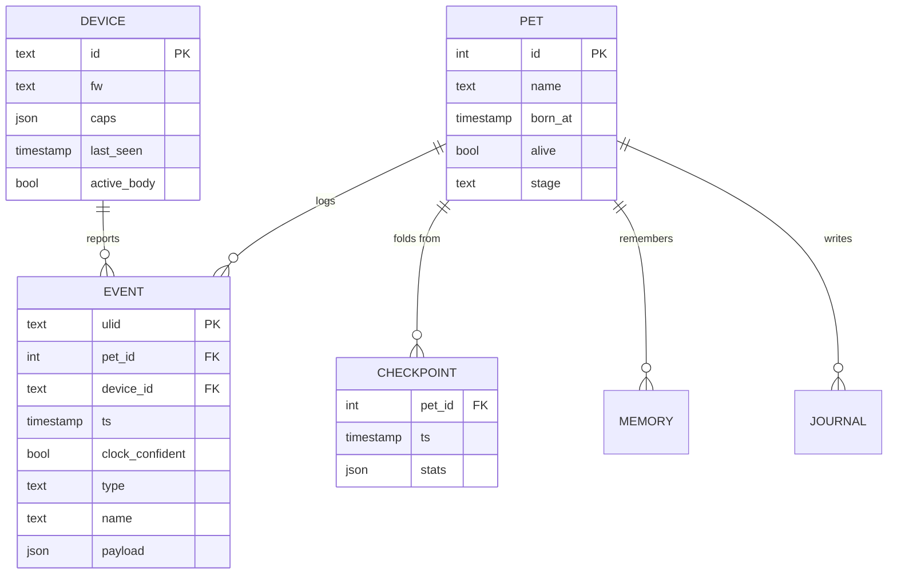

# Simulation

The part of the pet that is a *game* rather than a chatbot. No LLM appears
anywhere on this page, and that is the point: with every model unplugged the
pet still gets hungry, still gets lonely, still dies if ignored. The brain
adds personality on top of a creature that already exists (FR-020).

## The rule that makes everything else possible

**State is a pure function of elapsed time and the event log.**

```text
state(t) = fold(decay, events[t0..t], checkpoint(t0))
```

Nothing else feeds in. No wall-clock reads scattered through the logic, no
randomness in decay, no dependence on the order two systems happened to
process something. Three consequences, each load-bearing:

- The **device can compute the same state independently** while offline, as
  a prediction, and be overwritten silently on reconnect. There is no merge
  logic anywhere in this project (FR-023).
- A **replay from any checkpoint reproduces the present exactly**, so
  reconciling a batch of late events is re-running the fold with them folded
  in at their true timestamps, not patching the current state.
- The tick can be **missed**. If the pod is down for an hour the next tick
  applies an hour of decay in one step, because decay is computed from
  `Δt`, not from "one tick's worth". A cron that fires every 60 s is a
  scheduling convenience, never a unit of time (FR-021).

## Decay

All stats clamp to 0..100. Rates are per hour, applied proportionally to the
elapsed interval.

| Stat | Change per hour | Notes |
|---|---|---|
| `hunger` | +4 | ×0.5 while asleep |
| `energy` | −3 awake, +12 asleep | Sleeps 23:00–07:00 local |
| `hygiene` | −2 | +5 per `clean` event |
| `social` | −6 | Resets to 0 on any interaction |
| `health` | −5/h if `hunger` > 85 or `hygiene` < 10 | +2/h otherwise |

`hunger` is inverted: 0 is full, 100 is starving. `social` follows the same
convention — high is bad, it means *lonely*. The other three read the
intuitive way. Keeping this straight is worth a comment at the top of the
implementation, because a sign error here is invisible until the pet behaves
inexplicably at 2 a.m.

Sleep is local wall-clock, not a stat. It is the one place the simulation
looks at a calendar, and it is why the daemon needs a configured timezone
rather than running in UTC and hoping.

## Mood is derived, never stored

```text
health < 30                      → sick
energy < 20                      → sleepy
hunger > 70                      → grumpy
social > 70                      → lonely
all stats good + recent play     → excited
else                             → content
```

Evaluated in order — the first match wins, so a sick pet is sick even if it
is also hungry. Storing mood would mean two sources of truth that can
disagree; deriving it means the mood is always explicable from the numbers
on screen, which matters when the owner asks *why is it grumpy*.

`happy` exists in the vocabulary but is not produced by this table. It is
reachable only through a `say` — the brain may choose it as an
`expression` for one utterance. That asymmetry is intentional: contentment
is a state, happiness is a moment.

## Transitions are the interesting event

The tick emits a `mood_changed` event when the derived mood differs from the
last one. That event, not the tick, is what the [brain](brain.md) subscribes
to (FR-050). Calling an LLM every minute the pet is grumpy produces forty
identical complaints an hour; calling it the moment it *becomes* grumpy
produces one, at the right time.

The same shape applies to neglect: thresholds at 4 h, 12 h and 24 h since
`last_interaction` fire once each on crossing, and re-arm only after an
interaction.

## Death

`health == 0` sustained for 6 consecutive hours. Not "health hits zero" —
a six-hour grace window means a pet can be rescued by someone who notices,
which is the difference between a game and a punishment.

Whether death is permanent is [an open question](../open-questions.md); the
architecture assumes a `revive` command that costs the streak, because that
is the reversible choice. `alive: false` is a state the device must render —
a dead pet is not a disconnected pet, and they must not look alike.

## Evolution

`stage` advances on `age_days` gated by care quality, so a neglected pet
stays a baby. The exact thresholds are a tuning matter for Phase 2, not an
architectural one; what the architecture fixes is that `stage` is derived
from the same fold as everything else and appears in `state` as a closed
enum ([protocol](protocol.md)).

## Storage



A checkpoint every hour keeps the fold short; the event log is the durable
truth and is never compacted, because it is also the raw material for the
journal and for answering *what did I do to it*.
