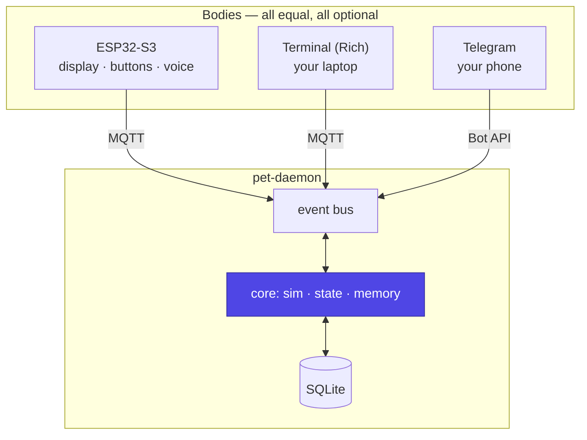

# Terminal body (TUI)

A pet that lives in a terminal window, built with Python and
[Rich](https://rich.readthedocs.io/). It exists for one reason that matters
more than it sounds: **it makes the hardware optional**. Somebody who never
buys an ESP32 still gets the whole pet — the simulation, the memory, the
personality, the homelab reactions — in a pane of their terminal, next to
the work the pet is supposed to be keeping them company through.

!!! abstract "The rule"
    **The TUI is a body, not a demo.** It speaks the same protocol, emits
    the same events, obeys the same TTLs and is subject to the same
    "the daemon owns the truth" rule as the ESP32 (FR-120). If a feature
    needs a special case in the daemon to support the terminal, the design
    is wrong.

That constraint is what earns the feature: a second, independent renderer is
the cheapest possible proof that the protocol is body-agnostic
([bindings](bindings.md)). Anything the TUI cannot do from `state` + `say`
alone is a hole in the contract, found in Python in an afternoon rather than
in C on a device six months later.

## Three faces, one pet



None of the three is primary. A user may run all three, or only the terminal,
and the pet is the same creature with the same age and the same grudges in
each. Which one is *active* — where a spontaneous `say` should land — is the
daemon's `active_body` pointer, most recent event wins (FR-062).

## Two modes

### Connected — the normal case

The TUI subscribes to `obp/state` and `obp/say`, publishes to
`obp/body/<id>/event`, and registers itself in the device registry like any
other body (FR-121):

```json
{
  "v": 1, "dev": "tui-thinkpad-jc", "fw": "tui 0.1.0",
  "caps": ["display", "buttons", "text_input"],
  "reset_reason": "power_on"
}
```

**It claims only what it has.** No `buzzer`, no `imu`, no `speaker` — so the
daemon never sends it a `say` with `tts: true`, and the `caps` field earns
its place instead of being decoration.

### Solo — no homelab, no broker, no container

```bash
uvx obp tui --solo
```

The daemon core runs **in-process**, against a SQLite file in the user's XDG
data directory, with the canned brain and no network at all (FR-122,
NFR-016). The MQTT adapter is replaced by a direct connection to the same
internal bus — which is possible only because the core consumes events and
emits state rather than knowing about MQTT (FR-060).

This is the mode that makes the project adoptable: `uvx` and one flag, and
somebody has a pet. It is also the strongest argument for the ring
architecture in the [overview](overview.md), because solo mode is not a
second implementation of anything — **the simulation code is the same code**
(FR-123). A pet raised in solo mode can later be pointed at a real daemon; a
pet raised on a second, subtly different simulation could not.

The trade is honest and should be said in the UI: in solo mode the pet lives
on that machine, in that file. No phone, no device, no backup.

## Rendering

The server sends an `expression` id, an `animation` id and a `mood`. The TUI
owns the art, exactly as the firmware owns its sprites (FR-127) — the same
rule, a different medium.

```text
┌─ Nubbin ───────────────────── child · 12d ─┐
│                                            │
│            ( o  o )      ~ zzz             │
│             \  ~  /                        │
│              `---'                         │
│                                            │
│  "you finally showed up. i counted 4       │
│   hours."                                  │
├────────────────────────────────────────────┤
│ hunger  ███████░░░░░░░░░░░░░  34           │
│ energy  ██████████████░░░░░░  71           │
│ hygiene ███████████░░░░░░░░░  58           │
│ social  ████░░░░░░░░░░░░░░░░  22           │
│ health  ██████████████████░░  90           │
├────────────────────────────────────────────┤
│ mood: lonely            ● connected        │
│ [f]eed [p]lay [c]lean [t]alk [q]uit        │
└────────────────────────────────────────────┘
```

An `expression` maps to a list of frames; an `animation` decides how they are
cycled (`bounce` nudges the face down a row, `shake` alternates a column
offset, `wobble` swaps two frames slowly). Idle blinking is local and needs
no server round trip, same as on the device — and it is most of what makes
the thing read as alive between events.

### Rich specifics

| Concern | How |
|---|---|
| Frame | `Layout` split into face / stats / footer, wrapped in `Panel` |
| Redraw | One `Live`, `refresh_per_second=8`, `screen=False` so scrollback survives |
| Face | `Text` with markup, centred with `Align` |
| Stats | Plain block characters, not `Progress` — no task/timer machinery for a static bar |
| Colour | Rich styles, honouring `NO_COLOR` and `--ascii` for terminals without Unicode (FR-128) |
| Resize | Handled by `Live`; the art has a minimum size and degrades to a one-line face below it |

**8 fps, not 30.** A terminal is not a display and this thing is open all
day: redraw on state change or animation frame only, and drop to a slow idle
cadence after a few minutes without events (NFR-014). A desk pet that shows
up in `top` is a desk pet that gets closed.

### Input — the one thing Rich does not do

Rich renders; it has no input loop. For single-keypress commands that is
~40 lines: put the terminal in raw mode with `termios`/`tty`, `select` on
stdin from a reader thread, and post keys onto the same async queue the MQTT
client feeds (`msvcrt.getch` on Windows). `[t]alk` is the exception — it
drops out of raw mode for one `input()`-style prompt, because a text box is
where hand-rolled input handling stops being cheap.

If the TUI ever wants scrolling journals, modals or mouse support, the
upgrade is **Textual** — by the same authors, built on Rich, so the art
table, the layout and the expression mapping all carry over unchanged. Start
with Rich; the day a feature wants a widget, that is the signal.

## Offline behaviour

The same DEGRADED model as the firmware, with different storage (FR-124,
FR-125):

| Firmware | TUI |
|---|---|
| Last state in NVS, throttled | Last state in `$XDG_STATE_HOME/obp/state.json` |
| Ring buffer of ~32 events | Same queue, same ULIDs, same `ts` |
| `clock_confident` may be false | Always true — a laptop has NTP |
| Disconnected glyph | `● connected` / `○ offline` in the footer |

It renders from the cached state before the broker connection is up, so the
face is there the moment the command returns (NFR-015).

## Several terminals at once

Expected, not an edge case: a TUI on the laptop and another on the desktop,
each with its own device id. All bodies subscribe to `obp/state`, so
they agree; `say` is delivered to every subscribed body in v1, so a line the
pet says appears in both windows. Per-body routing of `say` is a v2 concern,
alongside the second physical body ([roaming](roaming.md)).

## Secrets

In connected mode the TUI holds one credential: its own broker login
(NFR-011). No bot token, no API keys.

**Solo mode is the deliberate exception.** A machine running the daemon core
*is* a daemon, so a cloud brain there means an API key in that user's
environment — read from the environment or a config file under the XDG config
directory, never from the repo, and never required, since the canned brain is
the solo default (NFR-017).

## Distribution

```bash
uvx obp tui                 # connected, reads ~/.config/obp/client.toml
uvx obp tui --solo          # no daemon, no broker, local SQLite
uv tool install obp         # keep it on PATH
```

Consistent with how the docs are built ([README](https://github.com/jcarranz97/open-body-protocol#documentation)):
no virtualenv, no checkout, one command. The bar is that somebody hears about
this and has a pet thirty seconds later.

## Writing another body

The client half — transport, state cache, event queue, ULIDs, TTL handling,
reconnect backoff — lives in a reusable package that the TUI merely consumes
(FR-131). That is what makes this a framework rather than three programs that
happen to share a broker.

A new body has to do five things, and nothing else is required of it:

1. Connect and register with a distinct id and an honest `caps` list.
2. Render from `state`, `expression`, `animation` and `mood` — never from art
   sent by the server.
3. Emit events with a ULID and a true timestamp.
4. Drop a `say` whose `ttl_s` has expired.
5. Keep working, from cache, when the daemon is gone.

A web dashboard, a Discord bot, an e-ink picture frame and a status-bar
applet are all the same five things. None of them needs a change in the
daemon.

## What the TUI must never do

- Compute authoritative state, or resist being overwritten by the server.
- Implement its own decay rules — solo mode imports the core, it does not
  reimplement it.
- Invent an `expression` the vocabulary does not contain.
- Hold secrets in connected mode.
- Busy-loop, or redraw when nothing changed.
