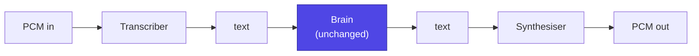
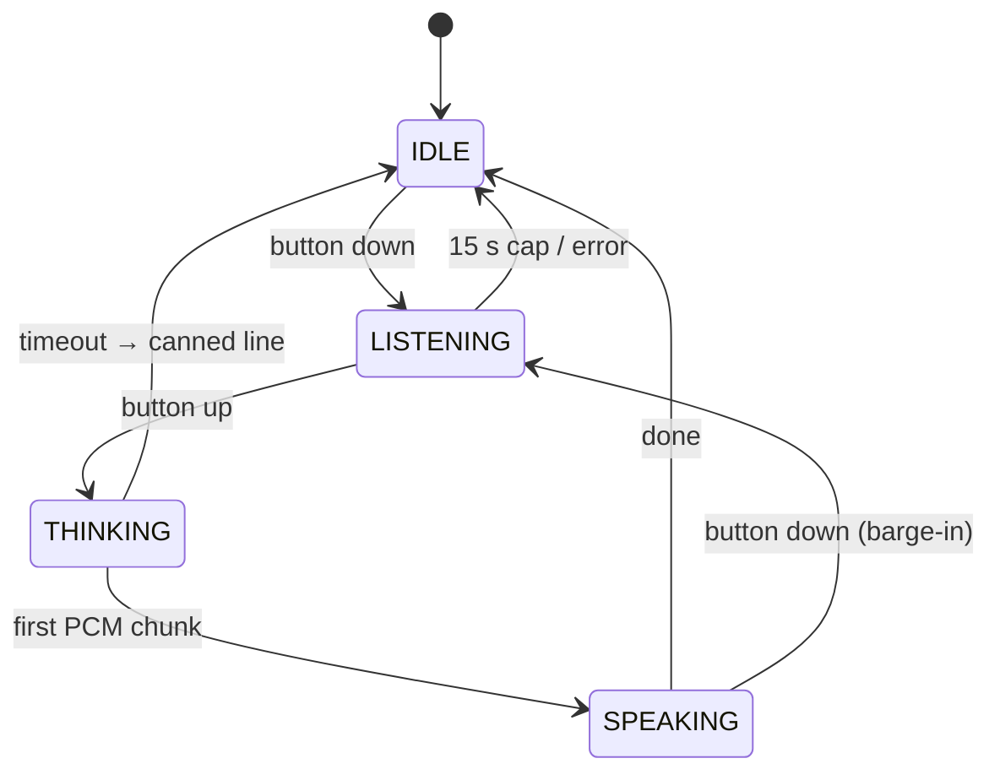

# Voice

Push-to-talk. Hold a button, talk, let go, get an answer in the pet's voice.
It is a v1 feature and the **last** one built (Phase 5) — but it decides the
board in Phase 1, so it is designed now
([hardware](hardware.md)).

## Why push-to-talk is the right call

Holding a button is not a compromise. It deletes most of the hard problems
outright:

- **No wake-word engine.** No false triggers, no per-user tuning.
- **No VAD.** Button down is the start marker, button up is the end marker.
  Perfect endpointing, for free.
- **No acoustic echo cancellation.** The pet never listens while it speaks,
  so no AEC hardware and no S3 audio front-end.
- **No always-on mic.** Privacy is structural rather than promised — which is
  the whole argument for an object that sits on a desk all day.
- **Far lower power and far cheaper silicon.**

Wake words can come in v3 if they are ever wanted. Do not start there.

## Transport

MQTT is a message bus, not a stream. Control stays on MQTT; audio gets its
own channel, opened per utterance (FR-080).

```text
button DOWN  → open WSS to wss://pet.dev.lan/audio
             → send {"type":"start","fmt":"pcm16","sr":16000}
             → stream binary frames (20 ms = 640 bytes) while held
button UP    → send {"type":"end"}
             ← {"type":"stt","text":"..."}          (show on screen)
             ← {"type":"say","line":"...","expression":"happy"}
             ← binary PCM frames → I2S out
             ← {"type":"done"}
             → close
```

A dedicated long-lived socket is unnecessary: open on button-down, close
after playback. Connection setup is ~200 ms on the LAN and happens while the
owner is still talking.

**Codec: raw PCM, 16 kHz mono 16-bit, for v1.** That is 32 KB/s — nothing on
a LAN. Opus would be ~20× smaller but costs ESP32 CPU and real integration
work; add it only if audio ever leaves the house.

**Buffering:** stream while recording rather than buffering-then-sending. It
hides the upload entirely behind the speech. The 8 MB of PSRAM holds minutes
of audio, so the buffer is a safety margin, not the design.

## Server pipeline

Voice adds exactly one stage on each side of the existing brain. **The brain
does not change at all** — a transcript is just another `conversation`
trigger (FR-081).



Both new stages get the same pluggable treatment as the brain:

```python
class Transcriber(Protocol):
    def transcribe(self, pcm: bytes, sr: int) -> str: ...

class Synthesiser(Protocol):
    def stream(self, text: str) -> Iterator[bytes]: ...   # PCM chunks
```

| Stage | Local option | Cloud option |
|---|---|---|
| STT | `faster-whisper` (small/base); Vosk for lowest latency | Deepgram, Groq whisper-turbo |
| TTS | Piper (CPU, fast); Kokoro (better) | ElevenLabs |

They live in the same `providers.yaml` as the brain, with the same fallback
chains. **Local-only is a completely viable full configuration**: Whisper
small + Qwen + Piper all run on one modest machine, and then no audio
ever leaves the house.

!!! tip "On voice choice"
    For a pet, a slightly strange, small, pitch-shifted voice is *better*
    than a photorealistic one. Piper with the pitch pushed up is more
    charming than the best commercial voice, and free. Spend the effort on
    the character, not the fidelity.

## Latency budget

Target: **first sound within 1.5 s of button release** (NFR-003).

| Stage | Budget |
|---|---|
| Upload tail (streamed during speech) | ~0 |
| STT | 300–800 ms |
| LLM first sentence | 400–1500 ms |
| TTS first chunk | 200–500 ms |

Three tricks matter more than any of those numbers:

1. **Stream TTS on the first sentence.** Do not wait for the full LLM
   response — split on the first `.` / `?` / `!` and start synthesising.
2. **React instantly on the device.** The moment the button lifts, play a
   thinking chirp and switch to a "hmm" animation. Perceived latency
   collapses even though nothing got faster.
3. **A pet is allowed to be slow.** A chatbot pausing for two seconds feels
   broken; a creature tilting its head for two seconds feels like it is
   thinking. This is a real advantage of the form factor — use it.

Hard timeouts: STT 5 s, brain 8 s local / 15 s cloud, TTS 5 s. On any expiry,
a canned line and a confused animation. It must never just hang.

## Device state machine

Extends the firmware state machine ([firmware](firmware.md)).



- **LISTENING** — obvious visual (ear or waveform), mic LED on. Hard cap 15 s.
- **THINKING** — chirp and animation immediately, never a blank screen.
- **SPEAKING** — mouth animation synced to output amplitude. Cheap, and very
  effective.
- **Barge-in** — pressing the button during SPEAKING stops playback and
  starts a new recording. A small feature with an enormous usability
  difference.

**Never open the mic outside LISTENING. Never buffer audio in IDLE.** That is
a firmware invariant, not a policy (NFR-010).

## Privacy

- The mic is electrically active only while the button is held, and the
  screen says so.
- The server keeps **transcripts, not audio**, by default. PCM is discarded
  after STT.
- A `voice_log` toggle can keep recordings for debugging. Off by default.
- With local STT and TTS, no audio ever leaves the house — a genuine
  advantage over every commercial smart speaker, and worth building for.

## Protocol additions

| Addition | Dir | Purpose |
|---|---|---|
| `obp/body/<id>/event` with `type: voice` | dev→srv | Transcript, for the journal and the Telegram mirror |
| `obp/cmd` op `set_volume` | srv→dev | Volume control from Telegram |

Mirror every voice exchange to Telegram as text. It costs nothing, gives a
free conversation log, and makes the pet feel like one continuous being
across both faces.
