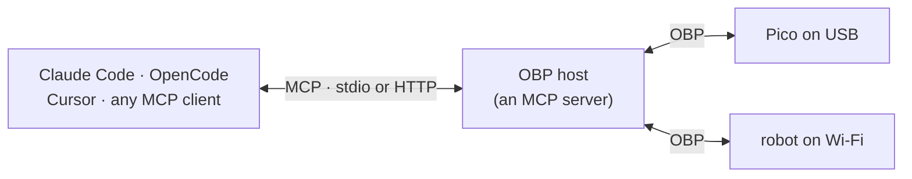

# Connecting an agent

OBP says nothing about what decides. This page is about the join: how Claude
Code, OpenCode, Cursor, a harness, or a script actually drives a body.

There are three ways, and the first covers almost everyone.

| | Path | Agent needs | Good for |
|---|---|---|---|
| **1** | The host is an **MCP server** | one config entry | Any MCP-speaking agent. The recommended path. |
| **2** | The host has a **CLI** | a shell | Agents that can run commands, and humans debugging |
| **3** | The host is a **library** | code | Building your own host |

## 1. MCP — the recommended path

An OBP host exposes the bodies it can see as MCP tools. The agent never
learns OBP, never opens a serial port, and never knows a body reconnected.



Claude Code:

```bash
claude mcp add obp -- obp mcp
```

Anything with an `mcpServers` config — OpenCode, Cursor, Codex, Claude
Desktop:

```json
{"mcpServers": {"obp": {"command": "obp", "args": ["mcp"]}}}
```

**Do not name a device node in that configuration.** `/dev/ttyACM0` is not an
identity: a board that re-enumerates becomes `/dev/ttyACM1` and the host is
left writing into a node that no longer exists. A host **SHOULD** discover
attached bodies itself, and where a specific one must be named, use a stable
identifier such as a `/dev/serial/by-id/` path ([presence](../spec/presence.md#device-paths-are-not-identities)).

That is the whole integration. The agent now has verbs for every body
present.

### The mapping is normative

Two hosts must expose the same body identically, or an agent configuration
stops being portable. A host **MUST** follow these rules.

#### Tool names

An OBP verb name and a body id are not directly usable as an MCP tool name:
clients constrain names to `^[a-zA-Z0-9_-]{1,64}$` — **dots are not
permitted**, and 64 characters is not much.

A host **MUST** build the name as:

```text
<sanitised-body-id>__<verb>
```

- Sanitise by replacing every character outside `[a-zA-Z0-9_-]` with `_`.
- Separate with a **double underscore**, so a single underscore inside either
  part is unambiguous.
- If the result exceeds 64 characters, truncate the body id — never the verb
  — and append `_` plus the first six hex characters of the SHA-256 of the
  full unsanitised `<id>__<verb>`.
- The result **MUST** be deterministic: the same body and verb produce the
  same name on every host, every run.

```text
pico-3f5022  +  set_brightness   →  pico-3f5022__set_brightness
```

Determinism matters more than elegance here. An agent that has learned a
tool name, or cached a prompt containing one, must not find it renamed after
a restart.

#### What is exposed

| OBP | MCP |
|---|---|
| verb `name` | part of the tool name, as above |
| verb `description` | tool `description`, prefixed with the body's `name` so a model can tell two crabs apart |
| verb `inputSchema` | tool `inputSchema`, unchanged |
| verb with `userOnly: true` | **not exposed at all** |
| result `content` | tool result `content`, unchanged |
| result `isError` | tool result `isError`, unchanged |

`isError` passing through 1:1 is why OBP borrowed MCP's result shape. A body
answering *"level must be 0..100"* reaches the model as a readable tool
error, and the model corrects itself — which is the entire argument for
[errors being results](../spec/results.md).

#### Ordering and change

- The tool list **MUST** be sorted deterministically
  ([descriptors](../spec/descriptors.md#ordering)), because a reshuffled
  array invalidates a model's prompt cache.
- A host **MUST** emit `notifications/tools/list_changed` when a body
  arrives or leaves, and **MUST** declare `tools.listChanged` in its
  capabilities.

That second rule is what makes hot-plugging work: plug a robot in
mid-conversation and its verbs appear, without restarting the agent.

#### Bodies that vanish mid-call

A host **MUST** return a tool result with `isError: true` and text saying the
body is not connected. It **MUST NOT** return a protocol error, and **MUST
NOT** hang until a timeout.

The distinction is not pedantry: MCP clients feed *execution* errors back to
the model so it can adapt, and treat *protocol* errors as a broken server.
A robot that was unplugged is the first kind.

#### Long actions

MCP tool calls are synchronous; OBP's [action lifecycle](../spec/results.md#long-actions)
is not. A host exposing `async` verbs **MUST** pick one and document it:

| Strategy | Behaviour | Suits |
|---|---|---|
| **Block** | Hold the MCP call until the action completes or the timeout expires | Actions of a few seconds. Simplest, and usually right. |
| **Detach** | Return `accepted` with a `call_id`, and expose `<body>__action_status` and `<body>__action_cancel` | Actions of tens of seconds, where the agent should keep talking |

Blocking is the default recommendation. An agent waiting four seconds for a
robot to finish turning is behaving correctly; an agent juggling call ids
usually is not.

#### When no body is attached

A host **MUST** start and stay running with nothing attached, and **SHOULD**
expose a status verb saying why — an agent that receives *"permission denied
on /dev/ttyACM0, the process is not in group dialout"* can tell the person
sitting there what to do. One that receives `CONNECTION_CLOSED` cannot.

This is not hypothetical: the reference host exited on an unreachable port,
and the resulting failure was indistinguishable from a broken server
([experiment 002](https://github.com/jcarranz97/open-body-protocol/tree/main/experiments/002-agent-drives-body)).

#### Sanitising body text

A body's `description` and result text reach a model, and a body is a device
someone else built. A host **MUST** treat them as untrusted
([security](../spec/security.md)): bound their length, strip control
characters, and present them as data rather than instructions.

## 2. The CLI — zero integration

Any agent that can run a command can drive a body, with no MCP at all. This
is also how a person tests one.

```bash
obp bodies                                     # what is present
obp describe pico-3f5022                       # its verbs and schemas
obp call pico-3f5022 set_brightness --level 40 # do something
```

Claude Code has a shell, so this works before any configuration exists. It is
the fastest way to find out whether a new body behaves, and a reasonable
permanent answer for an agent that already lives in a terminal.

The trade against MCP: no schemas in the model's context, so the agent has to
run `describe` and read it, and there is no `list_changed` — it discovers a
new body by looking again.

## 3. The library

For building a host: speak OBP over a [binding](../spec/bindings.md), keep a
registry, and offer the verbs to whatever you like. The
[conformance](../spec/conformance.md) host requirements are the contract.

This is the path [desk-buddy](https://github.com/jcarranz97/desk-buddy)
takes, because it wants identity, memory and behaviour on top of the verbs
rather than a bare tool list.

## Offer both

MCP and the CLI are not alternatives to choose between. MCP is lower friction
when it works: plain language reaches the right verb with the right
arguments, and no discovery step is needed because the schemas are already in
the caller's context.

But a host's configuration can be wrong, and MCP is the part that breaks when
it is. In [experiment 002](https://github.com/jcarranz97/open-body-protocol/tree/main/experiments/002-agent-drives-body)
every MCP failure was diagnosed through the CLI — an agent fell back to the
shell, read the host's own error text, worked around a permissions problem
and completed the task. **The CLI has no configuration to be wrong, which is
why it survives the configuration being wrong.**

A host **SHOULD** provide both, and say so in its documentation.

## What this page is not

- **Not a way for a body to reach an agent's tools.** A body cannot call the
  calendar. It advertises verbs and executes them; that is all a body does.
- **Not a requirement.** MCP is the recommended join, not part of OBP. A host
  may expose bodies through anything — a REST API, a harness plugin, a
  physical panel of switches — and a conforming body cannot tell.
