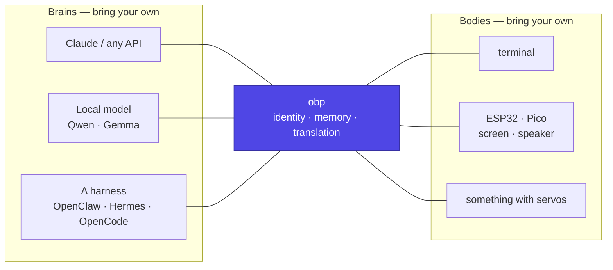

# OBP

**OBP connects a brain to a body.**

The brain is an AI agent — Claude, a local Qwen or Gemma, OpenClaw, Hermes,
OpenCode, anything that can hold a conversation and call a tool. The body is
whatever hardware someone built: a terminal window, a screen and a speaker,
a 3D-printed crab with servos, a commercial robot that adopts the contract.

Neither is ours. **The standardised way to marry them is.**

!!! info "Status — architecture, with the first claim tested"
    There is no `daemon/` yet. There *is* a working
    [experiment](https://github.com/jcarranz97/open-body-protocol/tree/main/experiments/001-pico-usb-body):
    a Raspberry Pi Pico describing its own abilities to a host that had never
    met it, over a bare USB cable, in two firmware languages. The pages here
    cite it rather than speculate.

## The two ports

Everything in this project is one of three things: the **body port**, the
**brain port**, or the small amount of daemon that sits between them.

| | What plugs in | What it must do |
|---|---|---|
| **[Body port](architecture/body-contract.md)** | Anything physical or rendered | Announce itself, describe its own abilities with schemas, accept intents, report honestly |
| **[Brain port](architecture/brain-contract.md)** | Any model or agent harness | Take context, return a decision |
| **The daemon** | — | Hold identity and memory, translate between the two, and stay out of the way |

A body advertises **tools**, not capabilities-by-name. It says *"I can
`move(direction, distance_cm)` and `set_brightness(level: 0–100)"*, with JSON
Schema, and the daemon turns that into something the brain can call. Nobody
teaches the daemon what wheels are.

## Why this and not the alternatives

The honest version, because the research is uncomfortable and it is better
stated than discovered later:

- **Agents with a persona, memory and tool use are a commodity.** OpenClaw
  has 387k stars and a `soul.md`; nanobot, airi and OVOS all ship the same
  bundle. Building another is not interesting.
- **Device-as-MCP-server over MQTT already exists too.** `xiaozhi-esp32` has
  29k stars, MIT, and a servo robot dog in its documentation. This project is
  the fourth convergent implementation of that idea, which is a *distribution
  advantage*, not an insight.
- **What nobody has is the layer that is indifferent to both ends.** Reachy
  Mini's abstraction covers a simulated Reachy Mini, not a body. Harnesses
  abstract brains and have no body concept. xiaozhi is one firmware family
  talking to its own backend. None of them survives "the model is on a Jetson
  beside the servos" *and* "the model is in a datacentre and the body is on
  Wi-Fi".

See [prior art](prior-art.md) for who is doing what, with licences.

## Topology is a binding, not an architecture

The same contract has to work at every scale, or the idea is hollow:

| Where things run | Brain | Body | Binding |
|---|---|---|---|
| **All in one box** — Jetson, Ryzen AI mini PC, Pi | local model | actuators on USB | stdio subprocess, no broker |
| **One box, split processes** | local model | local hardware daemon | unix socket / localhost |
| **Split** | a PC or the cloud | ESP32 over Wi-Fi | MQTT |
| **Nothing physical** | anywhere | a terminal | in-process |

A robot with the model inside its own chassis and the network unplugged is a
config file, not a fork ([deployment](architecture/deployment.md)).

## What the daemon actually owns

Very little, deliberately — but the part it owns is the part that makes the
thing feel continuous:

- **Identity and memory**, when the brain is a raw model. When the brain is a
  harness that already has a `soul.md` and a memory store, the harness owns
  them and the daemon steps back. Both modes are supported and the difference
  is explicit ([identity](architecture/identity.md)).
- **Translation.** Body tools become brain tools; brain decisions become body
  intents.
- **Presence.** Which bodies exist right now, and therefore which tools do.
- **Behaviour packs**, which are optional and where anything resembling a
  personality or a pet lives ([behaviour packs](architecture/behaviour-packs.md)).

## Where to start

1. [Overview](architecture/overview.md) — the shape, in one page.
2. [Body contract](architecture/body-contract.md) — the specification, and
   the thing to implement if you are building a body.
3. [Brain contract](architecture/brain-contract.md) — plugging in a model or
   a harness.
4. [Deployment](architecture/deployment.md) — where it runs.
5. [Experiments](https://github.com/jcarranz97/open-body-protocol/tree/main/experiments)
   — what has actually been tried, and what it changed.
