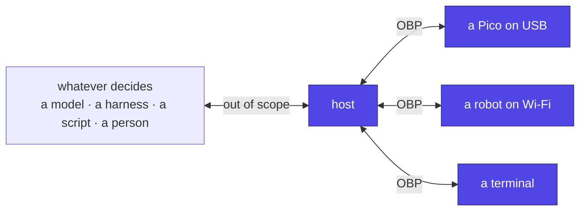

# Open Body Protocol (OBP)

**A standard way to give an agent a body.**

A body — a microcontroller, a robot, a terminal window — announces itself,
**describes its own verbs with schemas**, and executes them. A host discovers
those verbs at run time and offers them to whatever is deciding. Nothing in
the host is taught what a claw is.



## Scope

OBP specifies **how a body is described and driven**. It does not specify
what decides. How a model thinks, what it remembers, who it is, how it is
deployed — all deliberately out of scope, and answered by
[desk-buddy](https://github.com/jcarranz97/desk-buddy) or by whatever you
already use.

If you have an agent and want to give it a body, this is the part you need.

## In one screen

```jsonc
// host → body
{"jsonrpc":"2.0","id":1,"method":"body/describe"}

// body → host
{"jsonrpc":"2.0","id":1,"result":{
  "v": 0,
  "body": {"id":"pico-3f5022","name":"Pico body","fw":"0.1.0","caps":["led","dimmable"]},
  "tools": [{
    "name": "set_brightness",
    "description": "Set how brightly the indicator light glows, as a percentage.",
    "inputSchema": {"type":"object",
      "properties":{"level":{"type":"integer","minimum":0,"maximum":100}},
      "required":["level"]}}]}}

// host → body
{"jsonrpc":"2.0","id":2,"method":"tools/call",
 "params":{"name":"set_brightness","arguments":{"level":40}}}

// body → host
{"jsonrpc":"2.0","id":2,"result":{
  "content":[{"type":"text","text":"brightness 40%"}],"isError":false}}
```

That is most of the protocol. The rest is presence, errors, long actions and
the rules that stop the obvious mistakes.

## Principles

- **The body carries the schema.** A catalogue of known device types in the
  host fails the first time somebody builds something nobody anticipated,
  which is the premise.
- **Intents down, results up.** The host names what it wants; the body owns
  kinematics, timing, limits and reflexes. A tool call takes seconds; a motor
  needs milliseconds.
- **Errors are results.** A rejected call comes back as readable text, so a
  decider can explain itself rather than hang.
- **Transport is a binding.** In-process, stdio, serial, MQTT. A body on a
  USB cable must never need a broker.
- **Capabilities come from hardware.** The same firmware on a different board
  advertises a different verb list, and the host learns it by asking.

## Read in this order

1. [Specification overview](spec/overview.md) — roles, scope, lifecycle.
2. [Messages](spec/messages.md) and [descriptors](spec/descriptors.md) — the
   wire format.
3. [Conformance](spec/conformance.md) — what an implementation must do.
4. [Rationale](rationale.md) — why it is shaped this way, and what was
   rejected.
5. [Implementations](implementations.md) — working bodies, and how to write
   one.

## Status

**v0, unstable.** Published so implementations can find its edges. Two of its
requirements — deterministic verb ordering and `userOnly` — exist because
running code found problems the design had not.

There are two conforming bodies today, one in C and one in MicroPython,
[verified on real hardware](implementations.md#reference-bodies).
