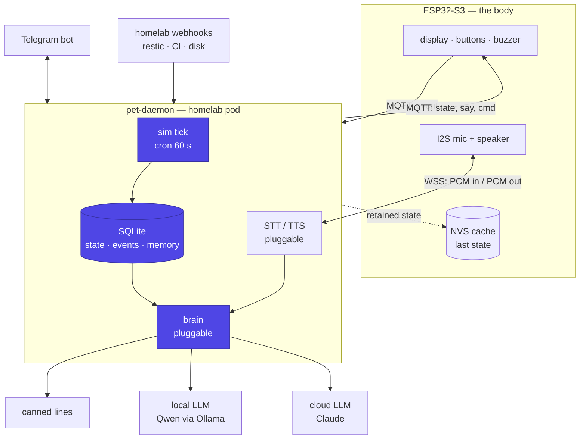

# TAMALAB Documentation

**TAMALAB** is a physical desk pet whose brain lives in a homelab. An
ESP32-S3 with a small screen renders a face, reads buttons and a
push-to-talk microphone, and chirps. Everything that decides *who the pet
is* — its stats, its memory, its personality, its opinions about your
failing backups — runs in a container on the LAN, and is reachable from
both the device and Telegram.

It is a Tamagotchi in the shape it always should have had: the toy is the
face, not the computer.

!!! info "Phase 0 — design only"
    This repository contains documentation and no code. There is no
    `daemon/` and no `firmware/` yet, deliberately: the
    [roadmap](roadmap.md) starts with a phase that is playable on Telegram
    alone, costs nothing, and is the one most likely to kill the project.
    The [original brief](brief.md) is kept verbatim as the seed document.

## How it fits together

## The three rules everything else follows from

**The daemon owns the truth.** The ESP32 holds a cached copy so it can keep
animating while the pod restarts. It never computes authoritative state and
never holds history. Reflashing the device does not reset the pet — which is
the entire reason the state lives on a server at all.

**The simulation is deterministic and needs no LLM.** Hunger, energy and
mood decay are a pure function of elapsed time and the event log
([simulation](architecture/simulation.md)). The pet is fully playable with
the brain switched off; the LLM adds *personality*, never state. It also
means device and server can compute the same state independently, which is
what makes an offline body possible.

**The brain is a config value.** Local, cloud, or none — behind one narrow
interface that asks for a single small JSON object
([brain](architecture/brain.md)). A canned-line table is the zeroth provider
and the permanent last fallback, so no path through the system can hang the
device waiting on a model.

## Scope

**v1 is WiFi-only, home network, USB-powered.** The device lives on the LAN
and talks MQTT to the daemon directly. No VPN, no rendezvous broker, no
cellular, no BLE, no battery. Off the LAN it goes into DEGRADED mode and
keeps animating until it comes home.

| In v1 | Not in v1 |
|---|---|
| A face that reacts, buttons, a buzzer | On-device LLM inference |
| Persistent state that survives reflashing | Battery, portability, roaming |
| Telegram as a second face for the same pet | BLE, cellular, WireGuard |
| Push-to-talk voice (last feature built) | Wake words, always-on listening |
| Reactions to real homelab events | Multi-user, multi-pet |

Voice is a v1 feature but the *last* one built, and it forces the board
choice up front: buy the ESP32-S3 with PSRAM in Phase 1 even though nothing
uses the mic until Phase 5 ([hardware](architecture/hardware.md)).

**v2 is the BLE keychain.** Everything in [roaming](architecture/roaming.md)
is deferred — it is documented now only for the handful of v1 decisions that
keep that door open, which are cheap now and expensive to retrofit.

## Technology

| Component | Choice | Why |
|---|---|---|
| Daemon | Python 3.13 + SQLite | One pod, one file, no server to operate |
| Control transport | MQTT (Mosquitto) | Retained state, LWT, pub/sub, tiny client |
| Audio transport | WebSocket over TLS | MQTT is the wrong shape for streams |
| Brain | Pluggable: canned / OpenAI-compatible / Anthropic | Local privacy or cloud quality, by config |
| Voice | Pluggable: faster-whisper + Piper, or cloud | Local-only is a viable full config |
| Firmware | ESP32-S3, FreeRTOS | PSRAM for audio, two cores, enough GPIO |
| Second face | Telegram | Already exists, and the pet feels continuous |
| Documentation | MkDocs Material | Same as `piezario` and `printforhelp` |

## Where to start reading

1. [Architecture overview](architecture/overview.md) — the shape of the
   system and why the split falls where it does.
2. [Protocol](architecture/protocol.md) — MQTT topics and the JSON payloads.
   The contract everything else is written against.
3. [Roadmap](roadmap.md) — five phases, each independently playable.
4. [Open questions](open-questions.md) — what has to be decided before
   Phase 0, and what can wait.
