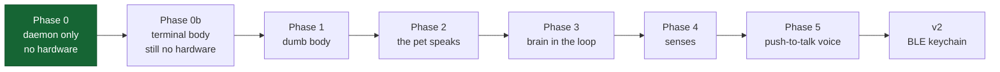

# Roadmap

Six phases to v1, then v2. **Each phase is independently playable — do not
start the next until the current one is boring.** That rule is the whole
schedule; the phase contents are negotiable, the ordering is not.

Requirements are numbered in [requirements](requirements.md) and cited here
as `FR-NNN`.

## Guiding constraints

- **Phase 0 costs €0 and is the one most likely to kill the project.** That
  is exactly why it goes first. If a Tamagotchi is not fun in a chat window,
  a screen will not save it.
- **Nothing before Phase 1 requires buying anything.** Phases 0 and 0b give
  a complete pet on a laptop, which is also the version most people who hear
  about this will ever run.
- **Buy the voice-capable board in Phase 1** (FR-110). The microphone sits
  unused until Phase 5. Retrofitting means redoing the enclosure and the
  pinout for a few euros of savings.
- **Nothing in the roadmap requires an LLM to be playable.** The brain
  arrives in Phase 3, after the pet already works.
- **The five v2-enabling decisions land in Phase 1** (FR-060 – FR-063), not
  when v2 starts.

## Phase 0 — daemon only, no hardware

- [ ] Container: Python + SQLite, one image, one volume — runnable on a
      laptop, a Pi or a cluster (FR-160, FR-164, NFR-006)
- [ ] `docker compose up -d` brings up daemon + broker and produces a working
      pet with no credentials configured (FR-163, FR-165, NFR-023)
- [ ] State schema, `pets` and `events` tables (FR-022, FR-026)
- [ ] Decay tick on a 60 s loop, computed from elapsed time (FR-020, FR-021)
- [ ] Wire up the existing Telegram bot: `/status` `/feed` `/play` `/clean`
      (FR-002, FR-090)
- [ ] Canned line table keyed by `(mood, expression)` — **no LLM yet**
- [ ] Decide the [open questions](open-questions.md) 1–3 and 5

**Exit criterion:** play it on Telegram alone for a week.

## Phase 0b — the terminal body

The pet gets a face without anyone buying hardware, and the protocol gets a
second implementation before the firmware exists. See
[terminal body](architecture/tui.md).

- [ ] Client package: MQTT transport, state cache, event queue with ULIDs,
      TTL handling, reconnect backoff (FR-131)
- [ ] Rich TUI: face panel, stat bars, speech bubble, footer (FR-127)
- [ ] Keypress reader in raw mode; `feed` / `play` / `clean` / `pet`, and a
      text prompt for `talk` (FR-129)
- [ ] Registration with a distinct id and an honest `caps` list (FR-121)
- [ ] Local state cache and offline rendering, mirroring DEGRADED (FR-124,
      FR-125)
- [ ] `--ascii` and `NO_COLOR` paths (FR-128)
- [ ] Idle cadence and redraw discipline (NFR-014)
- [ ] `--solo`: the core in-process against a local SQLite file, no broker
      (FR-122, FR-123, NFR-016)
- [ ] `uvx tamalab tui` published and working from a clean machine (FR-130)

**Exit criterion:** you leave it open in a pane for a week without closing
it, and somebody else runs `uvx tamalab tui --solo` and has a pet without
asking you anything.

## Phase 1 — dumb body

- [ ] A broker: bundled in the compose file by default, or an existing one
      by configuration; one user for the daemon, one per device (FR-016,
      FR-163). On an HTTP-only cluster ingress, prefer MQTT over WebSocket
      ([deployment](architecture/deployment.md))
- [ ] Daemon publishes retained `tama/pet/state` on every change (FR-030)
- [ ] ESP32: WiFi + MQTT + LWT, subscribe to state, render a face (FR-011)
- [ ] `Transport` interface in firmware, one implementation (FR-061)
- [ ] Buttons → `tama/dev/<id>/event` with ULID and timestamp (FR-013)
- [ ] The TUI from Phase 0b sees the device's events, and vice versa — one
      pet, two bodies (FR-120, FR-126)
- [ ] NVS cache and DEGRADED mode (FR-040, FR-041) — unplug the daemon and
      confirm the pet keeps animating
- [ ] Offline event queue with `clock_confident` (FR-042, FR-043)
- [ ] Device registry table (FR-062)
- [ ] JSON↔packed codec in the daemon, unit-tested but unused (FR-063)

**Exit criterion:** pressing a physical button changes what `/status` says in
Telegram, and killing the pod does not kill the pet.

## Phase 2 — the pet speaks

- [ ] `tama/pet/say` with `ttl_s` honoured on the device (FR-032)
- [ ] Sprite and animation table in flash, driven by ids (FR-031)
- [ ] Buzzer via LEDC — chirps do more for perceived life than any sprite
- [ ] Idle behaviour: blinking, drift, the occasional look-around
- [ ] Still canned lines only

**Exit criterion:** it feels alive across a room. Tune the timing here, not
later.

## Phase 3 — a brain in the loop

- [ ] `Brain` interface and `CannedBrain` first, then one real provider
      (FR-070)
- [ ] `character.md`, structured JSON output, strict validation and enum
      clamping (FR-072)
- [ ] Length clamping in the daemon — the schema will not do it (FR-143)
- [ ] Fallback chain on any parse failure (FR-074, NFR-005)
- [ ] `providers.yaml` and the routing table (FR-073) — even with one
      provider in it
- [ ] Eval harness: 30 golden fixtures, `make eval provider=…` (FR-077)
- [ ] Trigger rules and rate limit (FR-050, FR-051, FR-075); log every call
      with normalised cost (FR-076)
- [ ] `remember()` and the memory table; daily journal (FR-052)

**Exit criterion:** a week of use under ~40 calls a day, and you are
surprised by something it said.

## Phase 4 — senses

The phase where the pet stops being self-contained. Both MCP directions and
the sense tier land here, in this order — each is independently useful, so
stop whenever it stops being fun.

- [ ] `POST /event` webhook and the mapping config (FR-100, FR-101) — a
      `curl` from a git hook counts, a homelab is not required
- [ ] Collapse repeated events so a flapping service cannot drive the pet
      (FR-103)
- [ ] **MCP client**: the daemon reaches MCP servers itself, one call per
      utterance (FR-150, FR-151)
- [ ] **MCP server** `tamalab-mcp`: pet state and interactions as tools, so a
      coding agent can be a caretaker (FR-150, FR-152, FR-153)
- [ ] If deploying beside agents in a cluster, follow the egress precedent
      rather than opening anything inbound (NFR-021, [deployment](architecture/deployment.md))
- [ ] **Sense tier**, optional and absent by default: one harness behind the
      `Sensor` protocol, `agentic` timeout, fired on `homelab` and explicit
      asks only (FR-140, FR-141, FR-142, NFR-018, NFR-019, NFR-020)
- [ ] OTA over WiFi with hash verification (FR-034, NFR-012)

**Exit criterion:** the pet got visibly upset about something real, said
something *specific* about why, and you fed it from a coding session without
touching the device.

## Phase 5 — push-to-talk voice

The mic and amp have been on the board since Phase 1. Now use them.

- [ ] I2S mic capture at 16 kHz mono, gated strictly on the PTT button
      (NFR-010)
- [ ] WSS audio endpoint; stream PCM while the button is held (FR-080)
- [ ] `Transcriber` provider — start with local `faster-whisper` small
      (FR-082)
- [ ] Route the transcript into the existing `conversation` trigger —
      **no changes to the brain at all** (FR-081)
- [ ] `Synthesiser` provider (Piper), streamed back as PCM to I2S out
- [ ] Sentence-level TTS streaming and an instant thinking chirp (FR-083,
      FR-084)
- [ ] LISTENING / THINKING / SPEAKING states with barge-in (FR-085)
- [ ] Mirror every exchange to Telegram as text (FR-093)

**Exit criterion:** under 1.5 s from button release to first sound (NFR-003),
and you find yourself talking to it without thinking about it.

## Then, and only then — v2

Battery, BLE, keychain enclosure. See [roaming](architecture/roaming.md).
If Phase 1 did its job, this is an addition rather than a rewrite.
