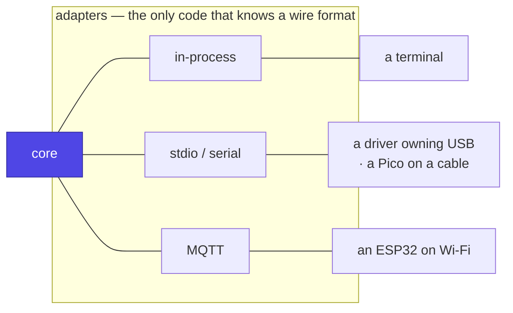

# Bindings

The [body contract](messages.md) says *what* is exchanged. A binding
says *how it travels*. There are three, they are interchangeable, and the
core cannot tell which is in use.

That interchangeability is not a nicety — it is what makes the
[topologies](https://github.com/jcarranz97/desk-buddy/blob/main/docs/architecture/deployment.md) work, from a model sitting beside the servos on
one board to a body across a Wi-Fi network.



## In-process

The body is a Python object in the daemon. No serialisation, no transport,
no failure mode. Used by the terminal body and by tests.

Presence is trivial: the object exists.

## stdio and serial

**The binding that matters most, and the one people forget to design for.**
A body is either a subprocess the daemon spawns, or a device on a cable.

```text
daemon ──spawn──▶ body driver (owns the USB bus, the GPIO, the servo hat)
       ◀─stdio──▶ newline-delimited JSON

daemon ──open──▶ /dev/ttyACM0
       ◀─CDC───▶ newline-delimited JSON
```

Both are the same framing, and both are what an all-in-one deployment uses:
a Jetson or a mini PC with the model, the daemon and the actuators on one
machine needs **no broker at all**.

This is the binding [experiment 001](https://github.com/jcarranz97/open-body-protocol/tree/main/experiments/001-pico-usb-body)
validated, in two firmware languages, on a Raspberry Pi Pico.

**Presence** is process or port liveness: the subprocess exits, or the port
closes, or `ping` goes unanswered. Cruder than MQTT's version, and it is why
presence is an abstraction rather than a retained message.

**Practical notes, learned the hard way:**

- Disable stdio CR translation on the device, or framing becomes `\r\n`.
- On MicroPython the REPL shares the USB CDC port; a body that has not been
  replugged since flashing will simply not answer.
- On Linux the device is `root:dialout`. A permissions failure surfaces as
  `EACCES` and mentions nothing about groups — the client should translate
  it, because it is the first thing between a builder and a working body.

## MQTT

For bodies that are not attached to the machine running the daemon.

Base prefix `obp/`. Names are **hierarchical**, so one subscription scopes a
class of device and the same structure maps onto broker ACLs later.

| Topic | Dir | Retain | Purpose |
|---|---|---|---|
| `obp/body/<id>/presence` | body → daemon | **yes** | Online, with a description |
| `obp/body/<id>/rpc` | daemon → body | no | A request |
| `obp/body/<id>/rpc/reply` | body → daemon | no | Its answer |
| `obp/body/<id>/event` | body → daemon | no | Unsolicited: a button, a sensor |
| `obp/srv/status` | daemon → all | yes | The daemon's own liveness |

**Presence is a retained message cleared by an empty-payload Last Will.**
Body connects, publishes retained; body dies, the broker publishes an empty
payload to the same topic, which clears the retained message. "Which bodies
exist" becomes "what is in the retained set" — no heartbeat table, no TTL
sweeper, and after a daemon restart the broker replays current truth.

Borrowed from EMQX's MCP-over-MQTT binding, which is otherwise dormant and
[not worth adopting wholesale](../prior-art.md).

**On a cluster with an HTTP-only ingress**, MQTT over WebSocket is
HTTP-shaped and routes like any web app — the same trick
[roaming](https://github.com/jcarranz97/desk-buddy/blob/main/docs/architecture/roaming.md) recommends for v2, arriving early for anyone deploying
that way.

### Access control

Per-body credentials, and an ACL that says what each may touch. A body may
publish only to `obp/body/<its-own-id>/#` and subscribe only to what it is
sent. It must not be able to impersonate the daemon or read another body's
traffic. One Mosquitto ACL file, and it is the difference between a lost
device being a toy and being a key.

## Versioning

Every payload carries `v`. It is bumped only on a **breaking** change; adding
an optional field is not breaking, since bodies ignore unknown keys and the
daemon defaults missing ones.

The rule that makes this safe: **the body is always the older peer.** It is
reflashed far less often than the daemon is redeployed, so the daemon must
accept every version it has ever emitted, while a body need only understand
its own.

## Choosing one

| Situation | Binding |
|---|---|
| Body is code in the daemon | in-process |
| Body is on this machine's USB, GPIO or serial | stdio / serial |
| Body owns its own board and network | MQTT |
| Body is a ROS 2 robot | MQTT, bridged with `mqtt_client` — config, no code ([deployment](https://github.com/jcarranz97/desk-buddy/blob/main/docs/architecture/deployment.md)) |
| Body is a phone or a browser | MQTT over WebSocket |

**A deployment may use several at once**, and routinely will: a terminal
in-process, a Pico on USB, and an ESP32 over Wi-Fi, all present in the same
registry with verbs from all three offered to the brain together.
