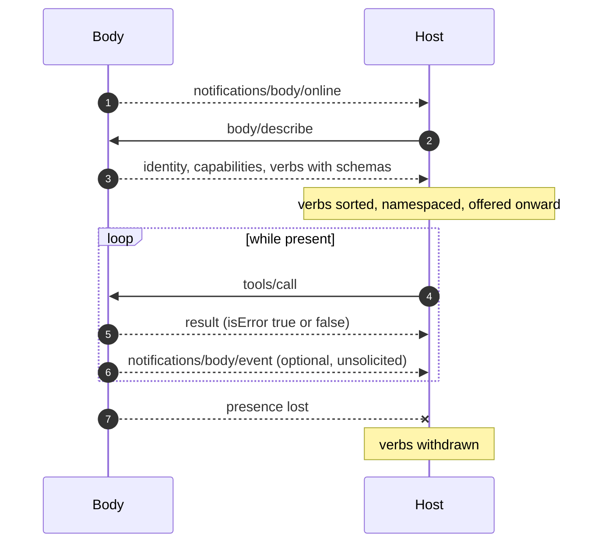

# Specification overview

Open Body Protocol (OBP) defines how a **body** describes what it can do,
and how a **host** drives it. That is the whole scope.

## Roles

| Role | Is | Does |
|---|---|---|
| **Body** | A thing that acts or renders — a microcontroller, a robot, a terminal window, a simulated device | Announces itself, describes its verbs, executes them, reports honestly |
| **Host** | The program a body connects to | Discovers bodies, tracks presence, invokes verbs, and offers them to whatever is deciding |

There is no third role in this specification. **What decides — a language
model, an agent harness, a script, a person pressing keys — is out of
scope.** OBP says nothing about how a brain thinks, what it remembers, or
who it is. A host may offer a body's verbs to a model through
[MCP](../guides/using-obp-with-mcp.md), through function calling, or through
a menu; the body cannot tell the difference and must not care.

## What a body promises

1. To be identifiable by something stable — normally its hardware.
2. To describe its own verbs, with schemas, at run time.
3. To claim only what it can actually do.
4. To execute an invoked verb and return a readable result, success or
   failure.
5. To own the *how*: kinematics, timing, safety and reflexes are the body's,
   not the host's.
6. To keep working when the host is gone.

## What a host promises

1. To discover verbs by asking, never from a built-in catalogue of device
   types.
2. To treat an unknown verb as data, not an error.
3. To withhold `userOnly` verbs from autonomous callers.
4. To remove a body's verbs when the body is no longer present.
5. To send intents, never raw actuator commands.

## Lifecycle

## Message shape

Every message is a JSON-RPC 2.0 object. Every request carries an `id`;
notifications carry none. Framing is one JSON object per line, unless a
[binding](bindings.md) says otherwise.

The protocol reuses **JSON-RPC 2.0** rather than inventing framing, and
borrows the **tool descriptor shape** from the Model Context Protocol so a
host can pass a body's verbs to an MCP-speaking consumer unchanged. Neither
choice makes OBP a profile of those specifications: there is no `initialize`
handshake, no capability negotiation round trip, and no dependency on an MCP
implementation at either end.

## Requirement levels

The key words **MUST**, **MUST NOT**, **SHOULD**, **SHOULD NOT** and **MAY**
are used as in RFC 2119. Every normative requirement is collected in
[conformance](conformance.md), which is the authoritative list; prose
elsewhere explains and illustrates them.

## Versions

This document specifies **OBP v0**, which is unstable and expected to change
as [implementations](../implementations.md) find its edges. Breaking changes
bump the integer in the `v` field ([versioning](versioning.md)).
