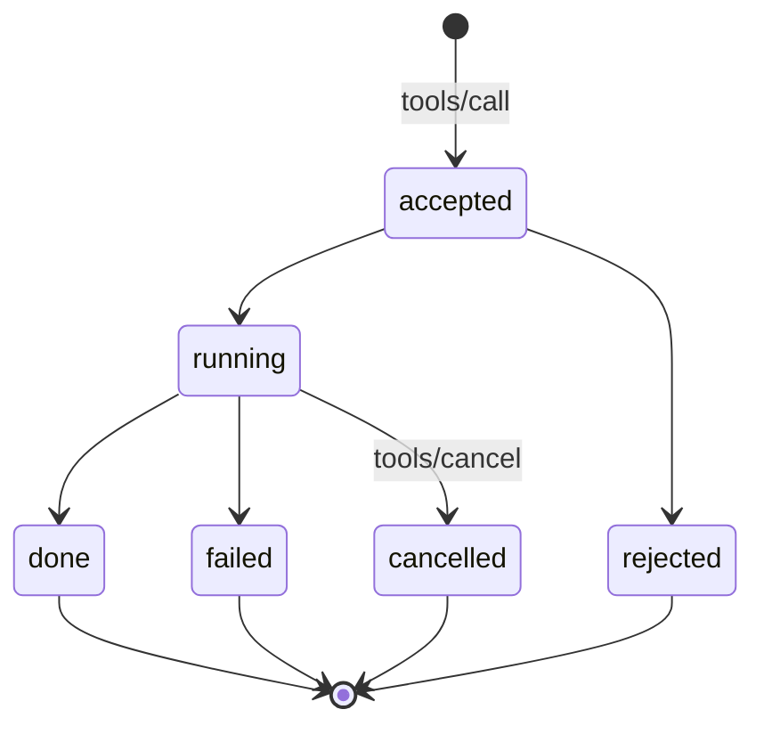

# Results and errors

How a verb reports what happened, and why the distinction between a *failed
call* and a *broken connection* is load-bearing.

## The result shape

```json
{"content": [{"type": "text", "text": "brightness 40%"}], "isError": false}
```

```json
{"content": [{"type": "text", "text": "level must be 0..100"}], "isError": true}
```

- `content` **MUST** be a non-empty array. Text is the only content type
  required; a body **MAY** emit others, and a host **MUST** ignore types it
  does not understand rather than failing.
- `isError` **MUST** be present.

The shape is MCP's, so a host bridging bodies to an MCP consumer passes
results through unchanged.

## A rejected call is a result

**This is the rule the rest of the page exists to support.** When a verb
cannot do what was asked — a value out of range, an unknown enum member, a
motor already at its limit, a jammed mechanism — the body **MUST** return
`isError: true` with a sentence saying why. It **MUST NOT** close the
connection, emit a protocol error, or crash.

The reason is that the consumer is frequently a language model, and there is
an enormous difference between:

> *"I can't turn that far — my servo stops at 180 degrees."*

and a stack trace, or worse, silence until a timeout. The first is something
a model can explain to a person and then work around; the second is a
failure of the whole system.

Validated in [experiment 001](../implementations.md#reference-bodies), where
`level=150` and `direction=sideways` both returned readable errors from
firmware written in two languages.

**The payoff is composition, not politeness.** Asked for twenty blinks
against a declared maximum of ten, an agent sent `times=20`, received *"times
must be between 1 and 10"*, and issued two calls of ten — delivering what was
asked while the body's limit held. An error that merely said *"invalid
argument"* would have permitted an apology; naming the limit permitted a
solution.

Note also what the host did **not** do: it passed `20` down rather than
pre-validating it away. A host that clamps arguments to be helpful hides the
body's real constraints from the only party able to reason about them.

| Situation | Response |
|---|---|
| Value out of range, bad enum, missing argument | result, `isError: true` |
| Verb exists but hardware is jammed or busy | result, `isError: true` |
| Verb was never advertised | result, `isError: true` |
| Message type not implemented | JSON-RPC error, code `-32601` |
| Malformed JSON | JSON-RPC error, code `-32700` |
| Body gone | the **host** synthesises a result, `isError: true` |

That last row matters: when a body disappears with a call in flight, the host
**MUST** return a result saying so rather than letting the caller block. A
model told *"the body is not connected"* says something sensible; a model
that hangs for sixty seconds does not.

## Text is for reading

`text` **SHOULD** be a short sentence a person could read aloud. It is not a
status code, and a host **MUST NOT** parse it to determine success — that is
what `isError` is for.

## Long actions

v0 is synchronous: a body receives `tools/call`, acts, and replies. Honest
for a 200 ms blink; wrong for a thirty-second walk.

A body whose verbs can take longer than a few seconds **SHOULD** implement
the action lifecycle, and **MUST** declare it by including `"async": true` on
the relevant descriptors.



The immediate reply is `{"status": "accepted", "call_id": "..."}`; progress
and completion arrive as `notifications/body/action` carrying the same
`call_id`; `tools/cancel` requests a stop.

This is the one genuinely good idea in ROS actions, taken as a convention
rather than a dependency. It is **specified now and optional in v0** because
retrofitting feedback later would break every body already built.

## Timeouts

A host **MUST** apply a timeout to every call and **MUST** surface expiry as
a result, not an exception. A body **SHOULD** complete a synchronous verb
within a few seconds or declare itself `async`.

Neither side may assume the other is fast. A body must tolerate a host that
pauses for a minute between calls; a host must tolerate a body that takes a
second to answer.
